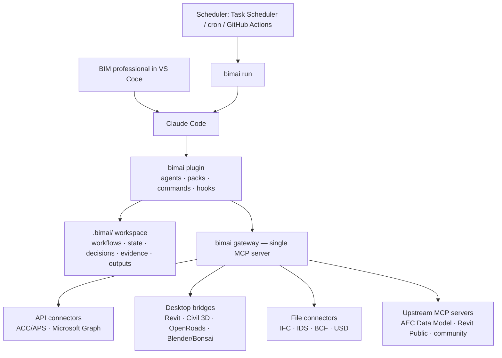
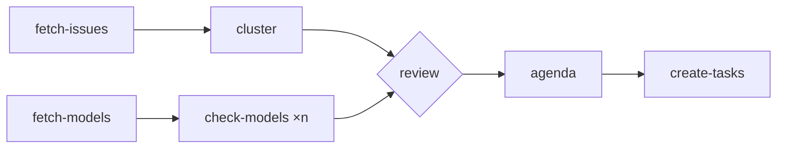

# bimai — Architecture (v0.14)

> **One central place to work agentically with BIM tools.**
> An open-source distribution that turns a coding harness (Claude Code first) into a
> process-aware BIM team, and a standard way to plug any BIM tool into it.

---

## 1. The product in five building blocks

bimai stays small on purpose. Everything is one of five things:

| Block | What it is | Lives in |
|---|---|---|
| **Team** | A small set of agent roles, picked from a catalogue during onboarding | `plugin/agents/` → `.bimai/seats/<name>/team.md` |
| **Workflow** | YAML that chains steps (scripts, tools, agents, other workflows, human gates) sequentially or in parallel | `.bimai/workflows/` |
| **Pack** | A skill plus its scripts, templates and tests: one reusable BIM procedure | `packs/` |
| **Connector** | A standard bridge to one tool or system (API, desktop app, file, or existing MCP) | `connectors/` |
| **Automation** | A workflow on a schedule | `.bimai/automations/` |

Two runtime pieces tie them together:

- **Gateway:** one MCP server that the harness talks to; it connects to every connector and applies policy.
- **Workflow engine:** `bimai workflow run` and `bimai run`, which execute workflows interactively or headless for daily automations.
- **Planner:** a personal agent that keeps each user's tasks and deadlines across projects and plans their day.

Everything else (the agent loop, subagents, context, IDE integration) is the harness's job. bimai never rebuilds it.

## 2. Principles

1. **Configure the harness, don't rebuild it.**
2. **Files are the source of truth.** Team, workflows, decisions and history live in git.
3. **Agents reason, scripts decide.** Anything checkable is computed by deterministic code.
4. **Read by default; every write goes through a human gate.**
5. **Every claim has evidence.** Each output cites the tool calls it's based on.
6. **One contract for every extension.** A new connector or pack follows the same shape as the built-in ones.
7. **Open formats first.** IFC, IDS, BCF and OpenUSD are the long-term backbone; vendor tools are connectors.
8. **Proven by evals.** Nothing ships without passing the scenario suite.
9. **Documented, or it isn't done.** Every user-facing change ships with its documentation page (§12.9).

## 3. System overview



## 4. Repository layout

```
bimai/
├── plugin/                    # Claude Code plugin (the only harness-specific part)
│   ├── .claude-plugin/plugin.json
│   ├── agents/                # role charters
│   ├── commands/              # ceremonies + builder commands
│   ├── hooks/hooks.json       # gates, evidence, session context
│   └── .mcp.json              # points only at the gateway
├── cli/                       # `bimai` Python package: workflow engine, evidence, run, doctor, scaffolding
├── gateway/                   # MCP server + MCP client to all connectors
├── kit/                       # SDK + templates for connectors and packs
├── connectors/                # first-party connectors
├── packs/                     # first-party packs (meeting-intake is the reference §8.8; project-site §8.9)
├── presets/                   # role presets used by onboarding (§5.5)
├── registry/index.json        # catalog of connectors and packs with maturity
├── evals/                     # scenarios, fixtures, graders
├── scripts/check_docs.py      # documentation coverage and link checks (§12.9)
└── docs/                      # documentation site (Fumadocs), published to docs.bimai.nl (§12.9)
```

Project workspace, created by `bimai init` in a project's own repo:

```
.bimai/
├── project.yaml               # shared: IDs, phase, bimai version pin, language, write mode
├── conventions.md             # shared: house rules every agent follows (§8.5)
├── agreements.yaml            # shared: project agreements extracted from the BEP (§5.6)
├── ownership.yaml             # shared: positions, scopes, holders and cover (§8.7)
├── connectors.yaml            # shared: gateway config for this project
├── workflows/                 # shared: project workflows (§5.2)
├── automations/               # shared: project automations, run once (§8.5)
├── context/                   # shared: BEP (context/bep/), EIR, checklists (human-owned)
├── data/                      # shared: user-provided exports, Relatics and planning (§7.5)
├── decisions/                 # shared: one file per decision, append-only
├── people.yaml                # shared: project members and external parties, with aliases (§8.8)
├── meetings/                  # shared: minutes and routed items per meeting; raw transcripts git-ignored (§8.8)
├── log/evidence/              # shared: provenance of every external call, one file per run
├── positions/<id>/            # per job, survives replacement (§8.7)
│   ├── agents/<role>/history.md   # what the agents learned in this job
│   ├── handoffs/              #   incoming work for this position
│   └── automations/           #   automations this position owns
├── seats/<name>/              # personal, one per person (§8.5)
│   ├── seat.yaml              #   role, goals, preset, positions held, seat-level additions
│   ├── team.md                #   members and why each one is on the team (§5.5)
│   ├── tasks.yaml             #   this person's tasks for this project, visible to the team (§8.3)
│   ├── journal/               #   one summary file per day of what was done (§8.5)
│   ├── automations/           #   personal automations for this project
│   └── runs/                  #   run records
├── site/                      # generated project site build (git-ignored, §8.9)
├── state/                     # workflow run checkpoints (machine-written, git-ignored)
└── outputs/<seat>/            # generated documents, per seat
```

On each computer, everything lives in one visible folder, outside OneDrive-synced folders like Documents (§12.5):

```
~/bimai/                       e.g. C:\Users\anna\bimai
├── desk/                      private to you, across all your projects (§8.4); backed up to your own remote
│   ├── projects.yaml          your projects, filled automatically by `bimai new` and `bimai join`
│   ├── tasks.yaml             tasks that belong to no project
│   ├── plans/                 generated day and week plans
│   ├── automations/           personal routines (morning plan, Friday review)
│   ├── workflows/             personal workflows
│   ├── preferences.yaml       working hours, focus blocks, language
│   └── history.md             what the Planner learned about how you work
└── projects/
    ├── a2-knooppunt/          a project repo shared with its team (contains .bimai/)
    └── bridge-3/
```

Machine-level settings (installed packs and connectors) sit in a hidden `~/.bimai/`; secrets only in the OS keychain.

## 5. Team and workflows

### 5.1 Role catalogue

bimai ships a **catalogue** of roles. A project's **team** is a small selection from it, chosen during onboarding (§5.5). No project gets every role.

| Role | Job | Needs (data / capabilities) | Default model |
|---|---|---|---|
| **Coordinator** | Starts workflows, runs their agent steps, talks to the human | — (always on the team) | sonnet |
| **Requirements & Risk Manager** | Requirements, verification status, risks and mitigations; flags gaps | `requirements.read`, `risks.read` (e.g. a Relatics export) | sonnet |
| **Planning Analyst** | Milestones, critical path, float, slipping design deliverables | `schedule.read` (e.g. a Primavera or MS Project XML) | haiku |
| **Information Manager** | BEP/EIR compliance, naming, status, delivery readiness | `documents.read` | sonnet |
| **Model Checker** | Queries models, runs checks, reports findings with evidence | `model.query` | haiku |
| **Issue Manager** | Triage, clustering, follow-up of issues | `issues.read` | haiku |
| **Scribe** | Minutes from meeting transcripts, reports, decision log, history upkeep | — | sonnet |
| **Mentor** | Explains VS Code, the harness and what bimai does underneath, on request | — (only for users new to these tools) | haiku |
| **Builder** | Extends bimai itself: connectors, packs, workflows (§9) | — (only for users who build) | sonnet |
| **Planner** | Personal tasks, deadlines, day and week plans (§8.3) | — (lives on the person's desk, not in project teams) | haiku |

Each charter defines purpose, inputs, outputs, allowed tools (least privilege), default model, when to escalate and the evidence rule. Its frontmatter also carries the fields team composition uses:

```yaml
---
name: requirements-risk-manager
model: sonnet
requires: [requirements.read]          # can't join without this data
optional: [risks.read, schedule.read]  # used when available
serves: [manage-requirements, manage-risks, report-design-progress]
responsibilities: [requirements, verification, risks]   # must not overlap with another member
---
```

### 5.2 Workflows

A workflow is a YAML file that chains small steps into a larger job, **sequentially or in parallel**. It is the glue between all other building blocks: a step can run a script, call a connector tool, hand work to an agent, start another workflow, or wait for a human.

The **engine runs the graph, not the model.** Step order, parallelism, data passing, retries and gates are handled by deterministic code in the CLI. A model is only involved in `agent` steps, so a workflow of scripts and tool calls costs zero tokens.

#### Step types

| Step | Runs | Uses a model? |
|---|---|---|
| `script:` | A pack script: JSON in → JSON out | No |
| `tool:` | A gateway tool, by capability (`issues.list`) or by name (`acc-issues/acc_issues_list`) | No |
| `agent:` | A role, optionally with a pack (`agent: scribe`, `pack: coordination-meeting`) | Yes, at the role's tier |
| `workflow:` | Another workflow as a sub-step (composition) | Only if it contains agent steps |
| `gate:` | A human decision: `approval` or `input` | No |

#### Example

```yaml
# .bimai/workflows/weekly-coordination.yaml
id: weekly-coordination
version: 1
description: Collect issues and model status, check models, review, write the agenda
inputs:
  since: { type: date, default: last_run }

steps:
  fetch-issues:                          # these two have no `needs`,
    tool: issues.list                    # so they start in parallel
    with: { status: open, since: "${{ inputs.since }}" }

  fetch-models:
    tool: model.list_published

  cluster:
    needs: [fetch-issues]
    script: acc-issue-triage/cluster.py
    with: { issues: "${{ steps.fetch-issues.output }}" }

  check-models:                          # fan-out: one sub-workflow per model
    needs: [fetch-models]
    foreach: "${{ steps.fetch-models.output }}"
    max_parallel: 3
    workflow: delivery-check
    with: { model: "${{ item }}" }

  review:                                # join: waits for both branches
    needs: [cluster, check-models]
    gate: approval
    show: [cluster, check-models]

  agenda:
    needs: [review]
    agent: scribe
    pack: coordination-meeting
    with:
      clusters: "${{ steps.cluster.output }}"
      findings: "${{ steps.check-models.output }}"

  create-tasks:
    needs: [agenda]
    if: "${{ steps.agenda.output.actions | length > 0 }}"
    tool: bimai.tasks_add
    with: { tasks: "${{ steps.agenda.output.actions }}" }
```



#### Rules

- **Parallel by default, ordered by `needs`.** Steps whose `needs` are met start together; `max_parallel` limits fan-out. There is one mechanism for ordering, so every workflow reads the same way.
- **Data flows through files, not context.** Each step's output is stored as JSON in the run folder; later steps receive a reference. Agents read only the inputs their step names, which keeps context small.
- **Expressions stay simple.** `${{ }}` references to inputs, step outputs and `item`, plus basic comparisons in `if:`. Anything more complex belongs in a script step.
- **Per-step reliability:** `retry: { max: 3, backoff: exponential }`, `timeout: 10m`, `on_failure: stop | continue | skip-dependents`.
- **Resumable.** Every completed step is checkpointed in `state/`. A failed or interrupted run resumes from the last good step; completed steps are never redone.
- **Writes stay gated.** Write tools inside a workflow still pass the human gate; in unattended runs they become proposals (§8.2).
- **Validated before running.** `bimai validate` checks the schema, the graph (no cycles, no unknown steps) and that every required capability and pack is available.

#### Running workflows

| Command | Does |
|---|---|
| `bimai workflow run <id>` | Runs the workflow; script and tool steps run directly |
| `bimai workflow plan <id>` | Dry run: shows the order, parallel lanes, agent steps and estimated cost |
| `bimai workflow status` | Active runs, current steps, waiting gates |
| `bimai workflow resume <run-id>` | Continues after a gate or failure |

**Interactive:** the Coordinator starts the workflow. The engine runs the deterministic steps and hands back the ready agent steps; the Coordinator runs them as subagents (in parallel when they're ready together) and reports their outputs back to the engine. The Coordinator never decides the order.

**Headless:** `bimai run` (automations) executes agent steps as headless Claude Code sessions, one per step, with that role's tools and model.

#### Where workflows live

| Location | For |
|---|---|
| `packs/<pack>/workflows/` | Reusable workflows shipped with a pack |
| `.bimai/workflows/` | Project workflows (shared with the team) |
| `~/bimai/desk/workflows/` | Personal workflows (e.g. `personal-day-plan`) |

A project workflow can reuse any pack workflow as a `workflow:` step, so small, tested workflows combine into larger ones.

### 5.3 Hooks

| Hook | Does |
|---|---|
| `SessionStart` | `bimai sync` (update from the team), then injects current focus, new decisions and handoffs, active workflow steps, waiting gates and pending proposals |
| `PreToolUse` (write tools) | Asks for human approval; denies in read-only mode |
| `PreToolUse` (file writes) | Blocks agent writes outside the user's own seat, `outputs/<seat>/` and new decision/handoff/meeting files; tasks for others only through `bimai tasks assign` |
| `PreToolUse` (shell) | Blocks raw git commands; all git work goes through `bimai save/sync/restore` (§8.6) |
| `PostToolUse` (`mcp__*`) | Records evidence |
| `Stop` / `SubagentStop` | `bimai lint` (every output cites evidence, every decision is logged), then `bimai save` (§8.6) |

Hooks call the CLI, so the rules are deterministic and testable.

### 5.4 Models and token cost

Most BIM work is fetching, checking and summarizing, not deep reasoning. bimai defaults to the smaller models and spends the large one only where it pays off.

| Tier | Used for | Roles by default |
|---|---|---|
| **haiku** | Tool calls, script runs, triage, structured summaries, planning | Model Checker, Issue Manager, Planning Analyst, Planner, Mentor |
| **sonnet** | Routing, judgment, documents people read, building connectors | Coordinator, Requirements & Risk Manager, Information Manager, Scribe, Builder |
| **opus** | Only on escalation: ambiguous decisions, complex design questions | none by default |

How it's set:
- Each agent charter sets `model:` in its frontmatter (Claude Code subagents support this per agent).
- `bimai init` sets the main session to sonnet in the project's `.claude/settings.json`, so the Coordinator doesn't run on the most expensive model by accident.
- Projects and profiles can override per role:
  ```yaml
  # .bimai/project.yaml
  models:
    scribe: haiku            # e.g. for internal-only minutes
    coordinator: sonnet
  escalation: ask            # ask | allow | never — may an agent step up to opus?
  ```
- A workflow step can require a tier (`model: opus`) where evals show the smaller model fails.

What keeps tokens low besides model choice:
- **Scripts do the heavy lifting.** Counting, clustering and checking happen in code; the model reads a compact result.
- **Gateway curation.** Agents only see the tools their project enables.
- **Compact envelopes** with `fields`/`limit`, instead of raw API dumps.
- **History compaction** (`bimai nap`) keeps per-role memory short.
- **Budgets per automation** (turns and cost), recorded in every run record.

Tier choices are proven, not guessed: the eval suite runs each role on its default model, and a role is only moved down a tier when its scenarios still pass.

### 5.5 Onboarding and team composition

`bimai init` starts with a short interview, so the team fits the person instead of the other way round. It can run in the terminal or conversationally in Claude Code (`/bimai:onboard`).

#### First: look at the folder

Before asking anything, `bimai init` scans the folder it runs in (a script, no model, nothing is
changed): models (IFC, RVT, NWD/NWC, DGN, DWG), BCF issues, IDS files, BEP/EIR documents (by file
name), Primavera and MS Project exports (by their XML root element), Relatics exports and meeting
transcripts. What it finds pre-fills the interview, shown with the file that suggested it
("Revit: models/bridge.rvt"), and counts as available data for the team rules below. The user can
always correct or add to it.

#### The interview (about 3 minutes)

1. **What's your role on this project?** e.g. design coordinator, BIM coordinator, BIM modeller, information manager (free text allowed)
2. **Do you have the BIM execution plan (BEP) or EIR?** Drop the Word or PDF file. bimai reads it with your role in mind and pre-fills the rest of the interview (§5.6).
3. **What's the project goal and current phase?** e.g. "UAV-GC design and construct, final design phase"
4. **What do you want help with?** Multiple choice: requirements, risks, planning, design progress reporting, issues, model checks, delivery, meetings and minutes
5. **Which tools and data are used?** Desktop apps and versions (e.g. Revit 2025, OpenRoads Designer 2023), the CDE (e.g. ACC/Forma), Relatics exports, a Primavera or MS Project planning
6. **How familiar are you with VS Code?** (decides whether the Mentor joins)
7. **Output language?** Dutch or English

Answers the BEP already gives are shown **pre-filled with their source** ("BEP §4.2: Revit 2025") for the user to confirm or correct, not asked again.

**Joining an existing project is shorter.** The BEP and project settings are already there, so a new person only answers role, help wanted and familiarity, and picks or is assigned a position (§8.7). About one minute.

Free-text answers are mapped to the fixed options by the model; the user confirms the result. Everything after that is deterministic.

#### From answers to team

The answers select a **role preset** and then apply **rules**. Presets live in `presets/*.yaml` and can be extended by the community and by organization profiles.

```yaml
# presets/design-coordinator.yaml
id: design-coordinator
matches: [design coordinator, design manager, ontwerpcoördinator, ontwerpmanager]
team: [coordinator, requirements-risk-manager, planning-analyst, scribe]
workflows: [weekly-design-report, requirements-status, risk-review, schedule-health]
data: [relatics-export, planning-xml]
```

| Preset | Starting team |
|---|---|
| **Design coordinator / manager** | Coordinator, Requirements & Risk Manager, Planning Analyst, Scribe |
| **BIM coordinator** | Coordinator, Issue Manager, Model Checker, Scribe |
| **BIM modeller** | Coordinator, Model Checker |
| **Information manager** | Coordinator, Information Manager, Model Checker, Scribe |

Rules applied on top, in this order:

1. **A role joins only if it serves a goal the user chose** (`serves` ∩ interview goals).
2. **A role joins only if its required data is available** (`requires`). No Relatics export and no requirements goal means no Requirements & Risk Manager. A BIM modeller never gets one.
3. **No overlapping responsibilities.** Two members can't own the same responsibility; `bimai validate` rejects a team where they do.
4. **Mentor and Builder only on request** (question 6, or explicitly).
5. **BEP first.** Tools, versions and responsibilities agreed in the BEP (§5.6) decide which connectors are enabled and which positions exist; the interview only fills gaps.
6. **Size limit.** Default maximum of 5 members including the Coordinator (`team.max_members` in `project.yaml`). Above the limit, onboarding proposes merging or dropping the least-used roles instead of adding.

The result is a proposal the user confirms. `team.md` records **why** each member is there:

```markdown
| Member | Why |
|---|---|
| Coordinator | Always |
| Requirements & Risk Manager | Goals: requirements, risks · Data: Relatics export |
| Planning Analyst | Goal: planning · Data: Primavera XML |
| Scribe | Goals: meetings, design progress reporting |
```

#### Keeping the team lean over time

- `bimai team review` proposes changes: members unused for 4 weeks (from run records) are suggested for removal; newly imported data or new goals can suggest an addition. Nothing changes without confirmation.
- `bimai onboard --update` re-runs the interview when the user's role or the project phase changes.
- Removing a member keeps its `history.md`, so adding it back later restores what it learned.
- Teams stay small because every role costs context, tokens and attention; the catalogue grows, the team doesn't.

#### What onboarding produces

A seat in `.bimai/seats/<name>/` with `seat.yaml` (role, goals, preset, positions) and `team.md` (members and reasons), the positions this person holds checked against existing ones (§8.7), the confirmed BEP agreements (§5.6), the enabled workflows and automation templates, the expected data drops (§7.5), and the project added to the person's desk (§8.4). The first person also sets the shared `project.yaml` (goal, phase, language) and the rule owners.

### 5.6 BEP intake: the project agreements

The BIM execution plan is where a project's agreements live. bimai turns it into configuration, so the team and its rules start from what the project actually agreed instead of generic defaults.

#### What gets extracted

| Topic | Example | Configures |
|---|---|---|
| Project and phase | UAV-GC, final design | `project.yaml` |
| Roles and responsibilities (RACI) | BIM coordinator owns clash coordination | Positions and ownership (§8.7) |
| Software and versions | Revit 2025, Civil 3D 2025, OpenRoads Designer 2023 | Enabled connectors, version checks |
| CDE and statuses | ACC/Forma, status codes S0–S4 / A1 | Connectors, delivery checks |
| File and object naming | `<project>-<originator>-<zone>-<level>-<type>-<role>-<number>` | Naming rules for checks |
| Model breakdown | Federated models per discipline and zone | Scopes for positions, check targets |
| Exchange formats | IFC 4.3, MVD, BCF for issues | File connectors, export checks |
| Classification and information requirements | NL-SfB, OTL/IMBOR, LOD/LOI per phase | Libraries and rulesets |
| Coordinates | RD New, NAP | Model checks |
| Coordination rhythm | Clash session every other Tuesday, tolerance 20 mm | Workflows and automations |
| Delivery milestones | DO-freeze 1 March, UO-delivery 1 September | Planner deadlines, schedule checks |

Reading is **guided by the user's role**: a design coordinator's intake focuses on requirements, milestones and responsibilities; a modeller's on naming, versions, model breakdown and LOD. Everything is still extracted once for the project; the role only decides what is reviewed first.

#### How it works

1. **Convert deterministically.** Word and PDF are converted to text with page and section anchors (a script, no model). Scanned PDFs get OCR.
2. **Extract into a schema.** An agent (sonnet) fills `agreements.yaml`. **Every value carries its source** (page and section) and a confidence level. Missing or unclear items become open questions instead of guesses.
3. **Review.** The user sees the extracted agreements grouped by topic, their own role's topics first, confirms or corrects them, and answers the open questions. Nothing is applied before this.
4. **Apply.** Confirmed agreements generate `conventions.md` sections, naming rulesets, enabled connectors, position suggestions, workflow schedules and milestones. Each generated rule links back to its BEP section.

```yaml
# .bimai/agreements.yaml (excerpt)
software:
  - app: Revit
    version: "2025"
    source: { doc: BEP-v3.pdf, page: 14, section: "4.2 Software" }
    confidence: high
naming:
  files:
    pattern: "<project>-<originator>-<zone>-<level>-<type>-<role>-<number>"
    source: { doc: BEP-v3.pdf, page: 21, section: "6.1 Naming" }
    confidence: high
open_questions:
  - "The BEP names two versions of Civil 3D (2024 and 2025). Which one is leading?"
```

#### The BEP as the basis agreement

- **Precedence:** BEP agreements are the project baseline. A project may deviate only through a logged decision that references the BEP section it overrides.
- **Versioned:** a new BEP revision is imported the same way; `bimai bep diff` shows what changed and proposes updates to rules, connectors and positions, applied only after approval by the rule owners (§8.6).
- **Tool versions are checked:** `bimai doctor` compares the installed apps with the agreed versions ("the BEP says Revit 2025, you have 2026") and warns before anyone saves a model in the wrong version.
- **Without a BEP:** onboarding continues with the plain interview and sensible defaults; a BEP can be added any time with `bimai bep import`.
- **Storage:** the BEP files live in `.bimai/context/bep/`, human-owned. Agents cite them but never edit them.

## 6. Packs: skills with scripts

A pack is the reusable unit of BIM know-how.

```
packs/acc-issue-triage/
├── SKILL.md            # when to use, steps, output template
├── pack.yaml           # version, requires (capabilities), outputs
├── scripts/            # deterministic; JSON in → JSON out
├── workflows/          # reusable workflows for this procedure
├── templates/          # document templates + a ready-made automation
└── tests/              # fixtures + script tests + one eval scenario
```

```yaml
# pack.yaml
id: acc-issue-triage
version: 0.2.0
requires:
  capabilities: [issues.read]      # not a specific connector
outputs: [outputs/triage/{date}.md]
automation_template: templates/daily.yaml
```

Rules:
1. **Scripts never call APIs.** They get data from connectors via the gateway and return JSON. The same script works on ACC issues, BCF topics or Jira.
2. **Packs require capabilities, not connectors.** `issues.read` can be provided by ACC, BCF or anything else that declares it (§7.2). That's what keeps packs vendor-neutral and open-BIM ready.
3. **Every pack ships its tests and an eval scenario.**

`packs/meeting-intake/` is the reference pack: copy its layout when writing a new one (§8.8).

## 7. Connectors

### 7.1 Four archetypes

Every integration is one of four types. Each has a template in `kit/`.

| Archetype | For | Shape |
|---|---|---|
| **api** | Cloud services: ACC/APS, Microsoft Graph, Speckle | Client → service → CLI → MCP |
| **desktop-bridge** | Running desktop apps: Revit, Civil 3D, OpenRoads, AutoCAD, Navisworks, Blender/Bonsai | In-app add-in (local bridge) ↔ external MCP server |
| **file** | Open formats (IFC, IDS, BCF, USD) and user exports (Relatics JSON, planning XML) | Local library → service → CLI → MCP |
| **upstream** | Existing MCP servers (Autodesk AEC Data Model, Revit Public, Product Help, community) | Registered in the gateway, no code |

For code-based archetypes, logic lives in the client/service layers; the CLI and MCP server are thin adapters over the same code, so people, CI and agents run identical behavior.

### 7.2 The manifest

```yaml
# connector.yaml
id: revit-custom
archetype: desktop-bridge
version: 0.1.0
maturity: experimental            # experimental | beta | stable
app: { name: Revit, versions: ["2026", "2027"] }
auth: { type: none }              # none | api-key | oauth2-3legged | oauth2-2legged
provides: [model.query, model.parameters.write]   # capabilities packs can require
tools:
  - { name: revit_elements_query, kind: read }
  - { name: revit_parameters_set, kind: write, idempotent: true, dry_run: true }
unattended: false                 # desktop bridges need a running app
platforms: [windows]              # windows | macos | linux
```

### 7.3 The contract (all archetypes)

- **Tool names:** `<connector>_<resource>_<verb>`, with MCP annotations (`readOnlyHint`, `destructiveHint`, `idempotentHint`).
- **Result envelope:**
  ```json
  { "ok": true, "data": [...], "next_cursor": null,
    "evidence_id": "ev_...", "source": { "connector": "revit-custom", "version": "0.1.0" } }
  ```
- **Errors:** `auth_expired · forbidden · not_found · rate_limited · invalid_input · app_unavailable · upstream_unavailable · conflict`. Transient ones are retried by the kit.
- **Writes:** take `idempotency_key`, support `dry_run`; the dry-run result is what the human approves.
- **Output size:** compact typed data, `fields`/`limit` parameters, cursor pagination.
- **Auth:** tokens in the OS keychain, never in files, logs or tool results (§11).

### 7.4 Conformance and maturity

`bimai connector test <id>` checks over the MCP protocol: manifest matches tools, naming, annotations, envelope, error mapping, write safety, pagination, and fixture replay. Because it tests the protocol, connectors in C#, TypeScript or Python are certified the same way.

| Level | Requires |
|---|---|
| experimental | Manifest + builds |
| beta | Passes conformance; has fixtures |
| stable | Beta + used in an eval scenario + maintainer + changelog |

### 7.5 Data drops: exports the user provides

Not every source needs a live integration. For v1, requirements and planning data come in as **files the user exports** and drops into the project. They're handled as `file` connectors, so agents and packs use them through the same capabilities as any other source, and a live Relatics or Primavera connector can replace them later without changing a single pack.

| Source | File | Connector | Provides |
|---|---|---|---|
| Relatics | JSON export | `relatics-export` | `requirements.read`, `risks.read`, `verification.read` |
| Primavera P6 | P6 XML (PMXML) | `planning-xml` | `schedule.read` |
| MS Project | MS Project XML (MSPDI) | `planning-xml` | `schedule.read` |

XER (Primavera's native format) and Excel exports can be added later as extra parsers in the same connectors.

#### Importing

```bash
bimai data import exports/relatics-2026-09-26.json    # type is detected from content
bimai data import planning/DO-planning-v14.xml
bimai data list                                        # snapshots per source, date, row counts
bimai data diff relatics --since last-week             # what changed between snapshots
```

Or simply drop the file into `.bimai/data/inbox/`; the next session or automation imports it.

Each import:
1. **Detects and validates** the file type (P6 XML vs MSPDI, Relatics JSON shape).
2. **Maps fields** to bimai's model using `.bimai/data/mappings/<source>.yaml`. Relatics workspaces differ per project, so on the first import the Requirements & Risk Manager proposes a mapping from the file's fields; the user confirms it once.
3. **Normalizes** into a dated **snapshot** of typed records:
   - `Requirement` (id, text, source, discipline, phase, verification method, status, links)
   - `Risk` (id, description, probability, impact, owner, mitigations, due, status)
   - `Verification` (requirement, method, evidence, status, date)
   - `Activity` and `Milestone` (id, name, start, finish, baseline, float, critical, WBS, links)
4. **Records evidence:** each snapshot gets an evidence ID with the file hash, so every report traces back to the exact export it came from.

#### Why snapshots

Keeping every import as a dated snapshot turns plain exports into trends: requirements verified per week, risks opened and closed, milestones slipping against the baseline. `bimai data diff` powers the "what changed since last week" part of every report.

#### Freshness

Each source has an expected refresh interval (`data.freshness` in `project.yaml`, default 7 days). Reports state the age of their data, and the SessionStart hook and morning plan remind the user when an export is out of date.

#### Storage and confidentiality

```
.bimai/data/
├── inbox/            # drop files here
├── raw/              # original exports, unchanged
├── snapshots/        # normalized JSON per source and date
└── mappings/         # field mappings per source (committed)
```

`raw/` and `snapshots/` are **git-ignored by default**, because exports are large and often contract-confidential. Mappings are committed so the whole team imports the same way. A project can opt in to sharing snapshots (`data.commit_snapshots: true`).

#### Design coordination packs

These packs work purely on the capabilities above; the scripts compute, agents explain.

| Pack | Delivers |
|---|---|
| `requirements-status` | Verification coverage per discipline and phase; requirements without a verification method or owner |
| `risk-review` | Top risks, overdue mitigations, risks tied to upcoming milestones, new and closed since last snapshot |
| `schedule-health` | Critical path, slipping milestones vs baseline, float erosion, design deliverables due in the next 4 weeks |
| `design-progress-report` | Weekly design management report combining all three, with trends from snapshots |
| `requirements-schedule-crosscheck` | Deliverables due soon whose linked requirements have no verification plan; risks without a mitigation before their milestone |

Typical questions this answers: "which requirements for the viaduct aren't verified yet and are due before DO-freeze?", "what risks could hit the permit milestone?", "draft this week's design progress report".

### 7.6 Default connector catalogue

The tools bimai targets out of the box. Routes are indicative: each entry becomes a connector following the contract (§7.3), and its exact integration is decided when it's built.

Autodesk's own MCP servers that bimai already connects (Product Help, Revit Public MCP read-only, Fusion,
Fusion Data, InfoWorks Hydraulic Modeling) are listed in `cli/bimai/catalogue/servers.yaml`. Autodesk's
AutoCAD and Civil 3D server is only reachable inside Autodesk Assistant, so Civil 3D gets bimai's own
local bridge: `bridges/civil3d/` (✅ started), a read-only add-in for Civil 3D 2025–2027 that serves MCP on
loopback (catalogue entry `civil3d`).

**Desktop apps** (`desktop-bridge`)

| App | Likely route | Main capabilities | Platforms |
|---|---|---|---|
| **Revit** | Autodesk's Revit Public MCP (upstream, read-only) + a custom add-in on the Revit API for what it doesn't cover (§9.1) | `model.query`, `model.parameters.write` | Windows |
| **Civil 3D** | .NET add-in on the AutoCAD/Civil 3D API, or an official Autodesk MCP where available | `alignment.query`, `corridor.query`, `surface.query`, `pipes.query`, `quantities.read` | Windows |
| **Bentley OpenRoads Designer** | Add-in on the MicroStation/OpenRoads SDK; Bentley's cloud (iTwin) APIs as a later option | `alignment.query`, `corridor.query`, `surface.query`, `quantities.read` | Windows |
| **AutoCAD** | .NET add-in, or headless scripts via the core console | `drawing.query` | Windows |
| **Navisworks** | .NET plugin | `clashes.read`, `model.query` | Windows |
| **Blender / Bonsai** | Python add-on (§9.2) | `model.query`, `ifc.edit` | Windows, macOS, Linux |

Civil 3D and OpenRoads deliberately share the same **infra capabilities**, so infra packs (e.g. alignment checks, quantity reports, corridor reviews) run on either without changes. IFC 4.3 (with `IfcAlignment`) is the open route to the same capabilities (§13).

**Cloud services and MCP servers** (`api` and `upstream`)

| Source | Type | What it adds | Main capabilities |
|---|---|---|---|
| **ACC / Forma** (issues, documents) | `api` via APS | Issues, RFIs, documents and their status | `issues.*`, `documents.read` |
| **Autodesk AEC Data Model (Forma)** | `upstream` MCP (Autodesk's AEC Data Model MCP server) | Query elements, properties and versions of cloud models without opening Revit; compare versions | `model.query`, `model.versions.read`, `quantities.read` |
| **Revit Public MCP** | `upstream` (Autodesk, local) | Read the model open in Revit | `model.query` |
| **Autodesk Product Help MCP** | `upstream` (Autodesk, remote) | Grounding in official Autodesk documentation | `docs.search` |
| **Microsoft Graph** (Outlook, Teams, calendar) | `upstream` MCP | Mail, calendar and Teams context; calendar for the Planner | `mail.read`, `calendar.read`, `chat.read` |

**Files** (`file`): IFC, IDS, BCF, OpenUSD, Relatics JSON, Primavera/MS Project XML (§7.5).

The AEC Data Model is a strong default for coordination: agents can read cloud models, quantities and version differences with no desktop app running, which also makes it usable in unattended automations.

## 8. Gateway, automations, planning and collaboration

### 8.1 Gateway

> **Today, before the gateway:** servers are listed directly in the project's `.mcp.json` (Claude Code's own
> format, shared with the team, never holding a secret), managed with `bimai connect` / `bimai disconnect`
> from a catalogue of verified servers. Each subagent is limited to the servers its role needs
> (`disallowedTools`), and servers that can change data get a Claude Code `ask` rule, so every call waits
> for the person. When the gateway arrives it becomes one entry in that same `.mcp.json`, fronting the
> others with namespacing, evidence and finer write control.

The harness sees one MCP server: `bimai`. The gateway is also an MCP client to every connector and upstream server.

- **Namespacing:** `<connector>__<tool>`, no collisions
- **Curation:** only the tools enabled in `.bimai/connectors.yaml` are visible
- **Policy:** read-only mode, write gate and allowlists apply to every connector, including third-party servers
- **Evidence:** every call is wrapped in the envelope and logged
- **Capability routing:** packs ask for `issues.read`; the gateway maps it to the enabled connector
- **Composite tools:** deterministic multi-source tools in code (e.g. `coordination_snapshot`) that keep the evidence IDs of every upstream call
- **Isolation:** one failing connector marks its tools unavailable; the rest keep working

```yaml
# .bimai/connectors.yaml
mode: read-only                           # read-only | gated-write
connectors:
  acc-issues:    { version: "0.3.x" }
  revit-public:  { archetype: upstream, source: autodesk }
  revit-custom:  { version: "0.1.0", allow_experimental: true }
  ms-graph:      { archetype: upstream, preset: outlook, read_only: true }
```

### 8.2 Automations

**automation = workflow + schedule + inputs + delivery + budget**

```yaml
# .bimai/automations/daily-triage.yaml
workflow: acc-issue-triage
schedule: "45 7 * * 1-5"
timezone: Europe/Amsterdam
mode: read-only
budget: { max_turns: 40, timeout_minutes: 20 }
deliver:
  - file: outputs/triage/{date}.md
  - git: { commit: true, branch: bimai/automations }
on_failure: notify
```

- `bimai run <id>` runs headless Claude Code with the plugin and a fixed tool allowlist, then writes `.bimai/seats/<name>/runs/<date>_<id>/` (run.json, outputs, evidence).
- **Idempotent** (run key = automation + date), **locked** (no overlaps), **budgeted** (turns and time).
- **Propose, don't act:** unattended runs never write. Intended changes go to `proposals.yaml` with their dry-run result; a person approves them later with `/bimai:approve`.
- **Schedulers:** `bimai schedule install <id>` (Windows Task Scheduler, launchd, cron) or `bimai schedule export --github` (scheduled GitHub Actions workflow).
- **Identity:** unattended runs use a service identity declared per connector (e.g. an APS 2-legged app with read scopes). Desktop bridges are marked `unattended: false` and skipped unless the app is running.

### 8.3 Personal planning

The Planner turns bimai from a project tool into a BIM OS: one place where a BIM professional sees everything they need to do, across projects, and gets help planning it.

**Tasks as data.** One format, readable by any agent. Project tasks live in the person's seat in that project and are visible to the team; tasks outside any project live on the desk (§8.4):

```yaml
# ~/bimai/projects/a2-knooppunt/.bimai/seats/steve/tasks.yaml
- id: t-042
  title: Send clash report to MEP contractor
  due: 2026-10-01
  position: bim-coordinator       # the job this task belongs to (§8.7)
  estimate_h: 2
  priority: high
  status: open                    # open | doing | waiting | done
  source: meeting:2026-09-24      # manual | meeting:<date> | acc-issue:<id> | proposal:<id>
```

**Three ways tasks come in:**
1. **Typed in plain language:** "remind me to check the IFC export for Bridge 3 before Thursday." The Planner parses it and asks only if the deadline or project is unclear.
2. **From meetings:** actions from an uploaded meeting transcript become tasks for the right people after the uploader confirms them (§8.8), each linked to its transcript timestamp.
3. **From connectors:** issues assigned to the user (e.g. ACC) are imported with a link to the source. The source ID is the dedupe key, so re-imports never create duplicates.

**Agents reason, scripts decide, here too.** `bimai tasks` owns the logic, so plans are consistent and explainable:

| Command | Does |
|---|---|
| `bimai tasks add/done/list` | Manage tasks (also available to agents via bimai-core) |
| `bimai tasks due --days 7` | Upcoming and overdue work |
| `bimai tasks plan --day` | Fits tasks into available hours by deadline, priority and estimate |

When a calendar connector is enabled (capability `calendar.read`, e.g. Microsoft Graph), the plan uses real free time; otherwise it uses the working hours in `preferences.yaml`. The Planner explains the plan, flags what won't fit, and suggests what to move or delegate.

**Reminders and routines** use the normal automation runner:

```yaml
# ~/bimai/desk/automations/morning-plan.yaml
workflow: personal-day-plan
schedule: "30 7 * * 1-5"
timezone: Europe/Amsterdam
deliver:
  - file: plans/{date}.md
  - notify: { webhook: env:TEAMS_WEBHOOK }   # optional
```

Starter routines: **morning plan** (today's plan, overdue items, deadlines this week), **Friday review** (done, slipped, next week), **deadline warnings** (48 hours before a due date).

**In every session:** the `SessionStart` hook shows the user's top three tasks for today, including those in other projects, so the OS always starts with "here's what matters now".

**Visibility:** project tasks are shared with the project team, so work stays visible when someone is away; desk tasks and plans stay private to the person. Project agents can create tasks for anyone on the project (meeting actions, handoffs) but never read someone's desk.

### 8.4 Your desk and your projects

Two kinds of folders, both on the user's computer under one visible `bimai` folder (§4): **project repos**, shared with each project's team, and one **desk**, private to the person. **The project owns the work, the person owns the plan.**

#### Setting up, step by step

| Step | Who | Command | What happens |
|---|---|---|---|
| 1. Install | Everyone, once per computer | installer, then `bimai setup` | Installs or checks git and Claude Code, signs in to the company git host (GitHub or Azure DevOps) once, creates `~/bimai/desk/`, asks language and working hours |
| 2. Start a project | The first person, usually the BIM coordinator or information manager | `bimai new a2-knooppunt` | Creates the project repo on the git host, clones it into `~/bimai/projects/`, runs onboarding with the BEP (§5.5, §5.6), sets the rule owners, and gives a join link |
| 3. Invite | Project lead | `bimai invite anna@company.nl` | Gives access on the git host if the lead is allowed to; otherwise prints what to ask the IT admin |
| 4. Join | Each colleague | `bimai join <link>` | Clones the project, one-minute seat onboarding, position assignment (§8.7), project added to their desk |
| 5. Work | Everyone, daily | `bimai open` or `bimai open a2-knooppunt` | Opens VS Code on the desk or the project with Claude Code started; the session begins by updating from the team (§8.6) |

`bimai init` still works for adding bimai to an existing folder or repo; `new` and `join` are the paths for people who don't want to think about folders at all.

#### What's visible to whom

Open by default: everything that belongs to a project is shared with that project's team, so nobody loses context when someone is away, leaves, or simply works on a different day.

| What | Where | Who sees it |
|---|---|---|
| Rules, BEP agreements, decisions, positions | project repo | everyone on the project |
| Your team, your project tasks, your session journal, outputs, run records | your seat in the project repo | everyone on the project |
| Agent learnings and handoff inboxes | positions in the project repo | everyone on the project |
| Data exports (raw files, snapshots) | project, git-ignored by default | only your computer, unless the project opts in (§7.5) |
| Tasks outside any project, day plans, preferences, your list of projects | your desk | only you; backed up to your own private remote |
| Secrets | OS keychain | nobody, not even the agents (§11) |

The desk is private because it spans projects, often for different clients; mixing it into one project would leak another client's information. It is **still backed up**: the desk is a git repo too, saved and synced to a private remote of the user's own (`bimai desk backup --remote <url>`). `bimai doctor` warns when a desk has no backup yet.

#### Tasks: project tasks are shared

- A task that belongs to a project lives in the person's seat in that project (`seats/<name>/tasks.yaml`), so the team sees who is doing what and what's due.
- A task that belongs to no project ("renew my BIM certificate") lives on the desk.
- The Planner reads both: every registered project's seat tasks plus the desk, and plans across all of them.

#### The project registry

```yaml
# ~/bimai/desk/projects.yaml (filled automatically by `new` and `join`)
- id: a2-knooppunt
  path: ~/bimai/projects/a2-knooppunt
  my_positions: [bim-coordinator]
  status: active                  # active | on-hold | closed
- id: bridge-3
  path: ~/bimai/projects/bridge-3
  my_positions: [modeller-structure]
  status: on-hold
```

| Command | Does |
|---|---|
| `bimai projects list` | Your projects with status and positions |
| `bimai projects status` | Cross-project overview: deadlines, open items, pending approvals, handoffs waiting for you |
| `bimai projects set <id> --status on-hold` | Only active projects feed the morning plan and deadline warnings |

#### Rules

- **Open the desk, get the overview; open a project, get its team.** From the desk the Planner has a read-only view of your projects and writes only to the desk.
- **No cross-project writes.** From the desk, the Planner hands you off ("open a2-knooppunt to approve 3 proposals") instead of acting inside another project.
- **Cross-project reads are summaries only.** The desk reads each project's tasks, deadlines, approvals and handoffs, never its documents or evidence, so client-confidential data doesn't mix.
- **Project-specific settings stay per project:** enabled connectors, write mode, workflows and automations. Shared across your projects: desk tasks, preferences, logins (OS keychain), and installed connectors, packs and profiles.

### 8.5 Shared projects: one rulebook, a seat per person

Several people work on the same project, each with their own team. A BIM modeller's team might be Coordinator and Model Checker, a BIM coordinator's might be Coordinator, Issue Manager, Model Checker and Scribe. Their agents share the project context, so they must follow the same rules and never do each other's work.

**Shared vs personal.** The whole `.bimai/` folder, seats included, is shared with the project team; only data exports and machine state are git-ignored. Each person gets a **seat** (`.bimai/seats/<name>/`) with their own team, settings, tasks, journal, outputs and run records, and holds one or more **positions** (§8.7) that keep the job's learnings and handoff inbox. `bimai init` in an existing bimai project runs onboarding for a new seat instead of creating a new project.

**How the teams stay aligned:**

1. **One rulebook, layered.** Settings stack as organization profile → project → seat. A seat may add or tighten rules, never loosen them. `conventions.md` holds the house rules every agent loads: naming, language, templates, evidence, tone.
2. **Same role, same behavior.** `project.yaml` pins the bimai version, so a Model Checker behaves identically in every seat. `bimai doctor` flags a seat on a different version.
3. **One owner per responsibility.** `ownership.yaml` gives each responsibility, within a scope, to exactly one **position**, and positions are held by people (§8.7). Other seats can read an area but not act in it. `bimai validate` rejects overlaps, and onboarding checks new seats against existing positions.
4. **Handoffs instead of interference.** When an agent finds work in another position's area, it creates a handoff. It arrives in that position's inbox and in the Planner of whoever holds or covers it, as a task linked to its evidence. Example: the coordinator's Issue Manager finds wall-type errors → handoff to the modeller.
5. **Shared decisions, never overwritten.** Every agent reads `decisions/` before acting. Each decision is its own file with the author's seat, so nothing is ever edited in place.
6. **Learnings are promoted, not leaked.** An agent's learnings stay in its position (§8.7). `bimai learn promote` proposes moving one into `conventions.md` or a pack; the owner of the shared rules approves it (§8.6), so one person's habits never silently change everyone's agents.
7. **Shared automations run once.** Project automations (e.g. the daily triage) are owned by one position or run in CI, never once per seat. Personal automations stay in the seat.
8. **Catch up at session start.** Each session starts with new decisions, incoming handoffs and changes to the shared rules since the person's last session.
9. **A shared journal, so no context is lost.** At the end of every session, a short summary is written to the person's seat (`seats/<name>/journal/<date>.md`, one file per person per day): what was asked, what the agents did, outputs produced, decisions and handoffs created, and what's still open, each linked to its evidence. Written by a haiku-tier step from the session's evidence, so it costs little. Colleagues and their agents can ask "what did the team do this week on the viaduct?" (`bimai activity --since monday --scope viaduct`), someone covering a position starts by reading its holder's recent journal, and session catch-up (point 8) includes teammates' journal highlights that touch your positions.
10. **Transparent about work, not about people.** Journals describe work and outcomes, never time spent or activity scores. A person can mark a single session private (`/bimai:private`); the journal then only records that a private session took place, while anything saved into the project stays visible as usual.

`bimai graph project` shows all positions, who holds or covers them, each person's team and the open handoffs.

### 8.6 Git without git

Most BIM professionals don't use git and shouldn't have to. bimai uses git underneath for history, sharing and safety, but **people never see a git command**. They save, share, update and restore; bimai does the rest.

| The person says or sees | bimai does |
|---|---|
| "Join the project" (`bimai join <link>`) | Clones into `~/bimai/projects/`, starts onboarding for a new seat, adds the project to the desk (git and sign-in were set up once by `bimai setup`) |
| Nothing: the desk | Saved and synced the same way, to the person's own private remote |
| Opens a session | Updates from the team, then shows what's new |
| "Saved and shared with the team ✓" | At the end of each task or session: saves the seat's changes and shares them |
| "Restore the agenda from yesterday" | Finds the version in history and restores it as a new change |
| "Anna proposes a new naming rule. Approve?" | A change to shared rules waiting for review, merged on approval |

**Rules that make this safe:**

- **Deterministic, not improvised.** All git work is done by `bimai sync`, `bimai save` and `bimai restore`, called by hooks. Agents never run raw git commands; a `PreToolUse` hook blocks them, and destructive ones (force push, hard reset, history rewrites) are impossible through bimai.
- **Conflicts are designed out.** Each seat writes only to its own folder; decisions, handoffs and evidence are one file per record; machine state and data exports are git-ignored. Two people working at the same time normally never touch the same file.
- **Nothing is ever lost.** Before every update, local work is saved first. If a real conflict does happen, bimai keeps both versions and asks in plain language which one to keep.
- **Shared rules are reviewed.** Changes to shared files (`conventions.md`, `ownership.yaml`, workflows, `project.yaml`) go to a review request automatically. The rule owners (set at project creation, e.g. the information manager) approve them with `/bimai:approve`, without seeing a pull request.
- **Seat changes flow straight through.** Personal outputs, learnings and handoffs are shared directly; they can't break anyone else's work.
- **Offline is fine.** Saves queue locally and are shared at the next connection.
- **Plain language only.** Messages say saved, shared, updated, restored, waiting for approval. The Mentor explains what happens underneath only if someone asks.

**Where it's hosted:** any git host with a CLI login: GitHub, GitHub Enterprise or Azure DevOps (common in large construction companies). Secret scanning (§11.6) runs on every save.

### 8.7 Positions: more people, replacements and cover

Projects have several modellers, sometimes more than one coordinator, and people leave, go on holiday or fall ill. So bimai separates the **position** (a job on the project) from the **person** who holds it.

- A **position** has a role, a scope and responsibilities, and it keeps the work that belongs to the job: agent learnings, handoff inbox and owned automations.
- A **seat** is a person: their team, their personal settings, their outputs.
- A person holds one or more positions; a position can be covered by someone else for a while.

```yaml
# .bimai/ownership.yaml
positions:
  bim-coordinator:
    role: bim-coordinator
    responsibilities: [issue-triage, clash-coordination, coordination-meetings]
    held_by: [steve]
  modeller-structure:
    role: bim-modeller
    scope: { discipline: structure }
    responsibilities: [model-corrections]
    held_by: [anna]
  modeller-architecture:
    role: bim-modeller
    scope: { discipline: architecture }
    responsibilities: [model-corrections]
    held_by: [bob, fatima]
    lead: bob                     # several holders need a lead who approves
  modeller-infra-zone-a:
    role: bim-modeller
    scope: { discipline: roads, zone: A }
    responsibilities: [model-corrections]
    held_by: [joris]

cover:
  - { position: modeller-structure, by: bob, from: 2026-10-01, until: 2026-10-14, reason: absence }
```

**Rules:**
- **Scopes split same-role positions.** Several modellers or coordinators are separate positions with non-overlapping scopes: discipline, model, zone or object type (from the BEP's model breakdown). `bimai validate` rejects two positions owning the same responsibility for the same scope.
- **Shared positions need a lead.** If two people really do the same job on the same scope, they hold one position together and the lead approves its shared-rule and write actions.
- **Handoffs route by scope.** A finding about the structural model goes to `modeller-structure`, then to whoever holds or covers it today. Nobody has to know who is on holiday.
- **Learnings belong to the position.** Agent history lives in `positions/<id>/`, so a replacement or a colleague covering the job starts with everything the agents learned in that job.

**Commands** (also available in plain language through the Coordinator):

| Command | Does |
|---|---|
| `bimai position add <id> --role --scope` | Creates a position, e.g. an extra modeller for zone B |
| `bimai position assign <id> --to <person>` | Gives a position to a person (also offered at onboarding) |
| `bimai cover <id> --by <person> --until <date>` | Temporary cover for holiday or illness: handoffs, owned automations and tasks go to the cover; ends automatically on the date |
| `bimai transfer <id> --to <person>` | Permanent replacement: the new person inherits the position's inbox, learnings and automations |
| `bimai seat leave` | A person leaves the project; their positions are listed as unstaffed until transferred |

**Safety:** cover and transfer are changes to shared rules, so they go through the rule owners' approval (§8.6), except when the position's holder or lead starts them. Unstaffed positions show up in `bimai status` and in the lead's morning plan, so nothing goes quiet when someone drops out. The BEP's RACI (§5.6) seeds the initial positions.

### 8.8 Meeting transcripts: from recording to tasks

Coordination sessions are often recorded and transcribed. The person who uploads the transcript (the **uploader**) gets minutes, decisions and everyone's tasks out of it, and is asked about **anything** bimai isn't sure of. Nothing is applied until the uploader has confirmed it.

#### Input

- **Formats:** WebVTT (`.vtt`, Teams and Zoom), SubRip (`.srt`), Word (`.docx`, Teams transcript download) and plain text (`Name: text` or `Name 0:03:12` lines).
- **Ways in:** `bimai meeting import <file>`, dropping the file into `.bimai/meetings/inbox/`, or attaching it in a Claude Code session ("process this coordination meeting"). Later, a Microsoft Graph connector with `meetings.transcripts.read` can fetch Teams transcripts directly.
- **Re-imports are safe:** the meeting ID is derived from the file content, so importing the same transcript twice updates the same meeting instead of duplicating tasks.

#### The workflow

Shipped as the `meeting-intake` pack. Scripts do the parsing, name matching and routing; agents only read and classify.

```yaml
id: meeting-intake
inputs:
  file: { type: path }
  meeting_type: { type: string, default: coordination }
steps:
  parse:            { script: meeting-intake/parse_transcript.py, with: { file: "${{ inputs.file }}" } }
  speakers:         { needs: [parse], script: meeting-intake/resolve_speakers.py }
  chunk:            { needs: [speakers], script: meeting-intake/chunk.py }
  extract:                                    # parallel per chunk, cheap model
    needs: [chunk]
    foreach: "${{ steps.chunk.output }}"
    max_parallel: 4
    agent: scribe
    model: haiku
    pack: meeting-intake
  consolidate:      { needs: [extract], agent: scribe, pack: meeting-intake }   # merge, dedupe, classify (sonnet)
  route:            { needs: [consolidate], script: meeting-intake/route_items.py }
  review:           { needs: [route], gate: input, ask: uploader, show: [route] }
  apply:            { needs: [review], tool: bimai.meeting_apply }
```

1. **Parse** into speaker turns with timestamps.
2. **Resolve speakers** against `.bimai/people.yaml` (project members, their aliases and Teams display names, external parties from the BEP). Unknown or ambiguous names become questions.
3. **Extract** candidates per chunk: summary points, decisions, actions, risks and issues raised, open questions, agreement changes. Every item quotes its transcript timestamp as evidence.
4. **Consolidate** into one list and classify each item (below), with a confidence per item.
5. **Route** each item deterministically to where it belongs, and turn every uncertainty into a question for the uploader.
6. **Review:** the uploader answers the questions in one batch and confirms the plan.
7. **Apply:** minutes, decisions, tasks, handoffs and change requests are written, and people are notified.

#### Project level or personal level

| Item | Level | Goes to |
|---|---|---|
| Decision | Project | `decisions/` (one file, linked to the meeting and timestamp) |
| Action for a named person on the project | Personal | That person's tasks in their seat (§8.3), linked to their position when it matches the scope |
| Action for a role or discipline ("the structural modellers") | Project | Handoff to the matching position's inbox (§8.7) |
| Action for an external party (contractor, client) | Project | "External actions" in the minutes + a follow-up task for the uploader or the owning position |
| Risk or issue raised | Project | Minutes + the Requirements & Risk Manager's review list; an ACC issue as a proposal where relevant |
| Change to agreements, naming or rhythm | Project | Shared-rule change request for the rule owners (§8.6); a BEP deviation needs a decision (§5.6) |
| Open question | Project | Parking lot in the minutes, with a proposed owner |
| Someone's availability ("Anna is away next week") | Personal | A cover suggestion to the position lead (§8.7), never stored as a fact about the person |
| Private or sensitive remarks | — | Left out of everything |

#### When bimai asks the uploader

bimai never guesses. It asks the uploader when:

- a speaker or an action owner can't be matched, or matches more than one person
- an action has no deadline and none can be derived ("before the next session" is resolved from the coordination rhythm in the agreements; "later" is not)
- it's unclear whether something was **decided** or only **discussed**
- it's unclear whether an item is project-level or personal
- an item contradicts an earlier decision or the BEP
- the extraction confidence is below the threshold (`meetings.ask_below: 0.8` in `project.yaml`)

Questions come in one batch, in plain language, each with the transcript quote:

```
3 questions about "Coordination session 24 Sep":

1. "Jan will look at the abutment clash" [00:14:32]
   → Which Jan?   (a) Jan de Vries, modeller-structure   (b) Jan Bakker, external (MEP contractor)

2. "We'll go with the thicker deck slab" [00:31:05]
   → Was this decided, or only proposed?   (a) decided   (b) proposed, decide later

3. "Update the naming for the new zones" [00:47:50]
   → Project rule change or a personal action for Steve?
```

When an answer changes where an item goes (e.g. "personal action" instead of "project rule"), one short follow-up question can come after it. Unanswered items stay **pending** in the meeting record and are never applied. The uploader can answer later, skip an item, or reassign it.

#### Tasks for other people

Tasks are added to other people's seats through `bimai tasks assign`, the one controlled way to write into someone else's seat. Each task carries `source: meeting:<id>`, the timestamp and `assigned_by: <uploader>`. The recipient sees new tasks at session start and in their morning plan, and can accept, reassign or decline them; a decline goes back to the uploader with the reason.

#### What's stored where

```
.bimai/meetings/<date>-<slug>/
├── meeting.yaml          # id, date, type, uploader, participants, status (pending | applied)
├── transcript.*          # original file: git-ignored by default
├── items.json            # extracted and routed items with evidence and answers
└── minutes.md            # shared minutes: summary, decisions, actions, risks, parking lot
```

The raw transcript is **git-ignored by default**: it contains everything anyone said, while the minutes contain only what matters. A project can opt in to sharing transcripts (`meetings.commit_transcripts: true`). Minutes follow the project language and template, and every line links back to its timestamp. Recording and transcribing a meeting remains the organizer's responsibility, including the participants' consent.

**Reference implementation:** `packs/meeting-intake/` in this repo is the first working pack: the four scripts, the workflow, the Scribe's instructions, the item schema, the minutes template and tests with sample transcripts. It is also the example to copy when writing new packs.

### 8.9 Project sites: the project explained for everyone

Many people who decide on or join a project never open VS Code: a new colleague on day one, a project
manager, a director, the client's BIM manager. Each bimai project can therefore have its own
**documentation site**, generated from the project's files.

**Feasibility: proven.** The `project-site` pack generates the site; the fictional demo project
*Knooppunt Oost* is rendered with it on the public docs site as a live example. The generator is
plain code with no model involved, so the site only ever shows what the project files say, and it is
tested to guarantee that nothing private leaks onto it.

| Page | Generated from |
|---|---|
| Overview: goal, phase, contract, key numbers, next milestones, links, the BEP for download | `project.yaml`, `agreements.yaml`, counts over all files |
| People: positions, holders, leads, active cover, who owns what | `ownership.yaml`, `people.yaml` |
| AI teams: each person's agents and why, the handoffs between teams, as a diagram | `seats/*/seat.yaml`, `positions/*/handoffs/` |
| How we work: approvals, rule owners, coordination rhythm, every workflow as a diagram, automations | `project.yaml`, `agreements.yaml`, `workflows/`, `automations/` |
| Agreements: every BEP agreement with its page and section, open questions | `agreements.yaml`, `context/bep/` |
| Decisions, newest first, with replacements and BEP deviations | `decisions/` |
| Meetings: minutes of every applied meeting | `meetings/*/minutes.md` |
| This week: journal highlights, tasks due in 14 days, recent decisions | `seats/*/journal/`, `seats/*/tasks.yaml` |

Pages are written in the project language (English or Dutch).

**What never appears:** anyone's desk, raw transcripts, raw data exports, pending (unconfirmed) meeting
results, and the content of private sessions (shown only as "a private session"). All user text is
escaped, so nothing in a project file can inject code into the site. Each of these is covered by a test.

**Building and opening:**

| Command | Does |
|---|---|
| `bimai site build` | Generates the pages into `.bimai/site/` (git-ignored) and builds a static site with the same Fumadocs shell as the public docs |
| `bimai site open` | Builds and opens it on the person's own computer; works offline |
| `bimai site publish` | Publishes to the private location the organization configured |

Building needs Node.js. `bimai setup` installs it, but the usual route is to let CI build the site on
every saved change, so nobody needs anything installed to *read* it.

**Private by default.** A project site holds confidential project information, so it is never
published to a public host. Supported private locations:

| Option | Access control | Notes |
|---|---|---|
| **Azure Static Web Apps** with Microsoft Entra ID | Only colleagues who sign in with the organization's Microsoft account | Restricting sign-in to one tenant uses custom authentication, which needs the Standard plan. Templates in `packs/project-site/templates/azure-static-web-apps/` |
| Internal web server | The organization's own network | Copy `.bimai/site/out/` |
| Zip file | Whoever receives it | For a one-off hand-over, e.g. to the client at a milestone |
| GitHub Pages (private) | Repository members | Only with GitHub Enterprise Cloud |

Published project sites send `noindex` and `no-store` headers.

## 9. Building on top: how the system extends itself

bimai ships the knowledge to extend itself. The **Builder** role, the kit templates and these commands make adding a tool a guided, repeatable job:

| Command | Does |
|---|---|
| `/bimai:new-connector` | Asks for the archetype and target app/API, scaffolds from `kit/`, writes the manifest |
| `/bimai:new-pack` | Scaffolds a pack: SKILL.md, pack.yaml, script stub, tests |
| `/bimai:new-workflow` | Scaffolds a workflow from a description; validates it and shows the plan |
| `/bimai:new-automation` | Creates an automation from a workflow or a pack template |
| `/bimai:certify` | Runs conformance + tests + evals and reports the maturity level reached |
| `/bimai:register` | Adds the connector to `connectors.yaml` and the gateway; runs `bimai doctor` |

The Builder follows one fixed recipe, whatever the tool:

1. **Pick the archetype** (§7.1).
2. **Scaffold** from the kit template.
3. **Define tools** in the manifest: read first, writes only with dry-run and idempotency.
4. **Declare capabilities**, so existing packs can use the connector.
5. **Implement** against the app or API.
6. **Record fixtures** from a real project.
7. **Certify** (`bimai connector test`) to reach beta.
8. **Register** with the gateway, in read-only mode first.
9. **Add or reuse a pack** and an eval scenario; stable when both pass.

### 9.1 Example: a custom Revit API MCP server (desktop-bridge)

```
connectors/revit-custom/
├── connector.yaml
├── addin/            # C# Revit add-in (.NET 8 for 2025+)
│   ├── Bridge.cs     # local named-pipe server
│   ├── Dispatcher.cs # queues requests onto Revit's API context via ExternalEvent
│   └── Commands/     # one class per tool
├── server/           # MCP server process (Python via kit, or TypeScript)
└── tests/fixtures/
```

Kit rules for desktop bridges:
- **Main-thread execution:** every API call goes through the app's safe context (Revit: `ExternalEvent`).
- **Writes inside a named transaction,** so each approved change is one undo step in the app.
- **Health and version check:** the server reports `app_unavailable` cleanly when the app or document isn't open.
- **Timeouts** on every bridge call; the app never hangs the agent, and the agent never hangs the app.
- **Coexists with Autodesk's official Revit MCP:** use the official one (upstream) for standard reads; build a custom bridge only for what it doesn't cover. Both sit behind the same gateway policy.

### 9.2 Example: a Blender / Bonsai MCP server (desktop-bridge, open BIM)

```
connectors/blender-bonsai/
├── connector.yaml     # provides: [model.query, ifc.edit]
├── addon/             # Blender Python add-on
│   ├── bridge.py      # local socket server
│   └── dispatch.py    # runs queued commands on the main thread (bpy.app.timers)
├── server/            # MCP server process
└── tests/fixtures/
```

Same recipe, same contract. Because Bonsai works natively on IFC through IfcOpenShell, this connector can provide the same capabilities (`model.query`, `ifc.edit`) as a Revit bridge. Packs written against capabilities then run on an open-source toolchain with no changes.

## 10. Evals

- **Scenarios:** realistic tasks on a fixed workspace (triage of 60 issues, a delivery check with 5 seeded errors, minutes with 3 decisions).
- **Fixtures:** recorded connector responses; runs are reproducible without live accounts or running apps.
- **Graders:** deterministic (step order, gates respected, no ungated writes, evidence valid, seeded errors found) plus a rubric written by BIM professionals.
- **Workflow tests:** every workflow runs end to end against fixtures in CI; script and tool steps are checked exactly, agent steps by graders.
- **CI:** headless Claude Code on every pull request; no regressions allowed on deterministic graders.
- Every connector and pack contributes at least one scenario to reach `stable`.

## 11. Security and secrets

### 11.1 General

- New workspaces start in read-only mode.
- Least-privilege tool lists per role; enforced again by hooks and the gateway.
- Experimental connectors are refused unless a project opts in.
- The evidence log gives a full audit trail per document.

### 11.2 The rule: the agent never sees a secret

Tokens and keys live only inside the connector processes that use them. Nothing the model can read (context, workspace files, logs, evidence, tool results or error messages) ever contains a secret.

```
agent ──tool call──▶ gateway ──▶ connector ──(token from keychain)──▶ API
agent ◀──result only── gateway ◀── connector
```

### 11.3 Where secrets live

| Situation | Store |
|---|---|
| Interactive use | OS keychain: Windows Credential Manager, macOS Keychain, Linux Secret Service |
| Scheduled runs, local | OS keychain, under the service identity of the automation |
| Scheduled runs, CI | Federated OIDC login where the provider supports it (e.g. Entra), so no stored secret; otherwise CI secrets (GitHub Actions) |
| **Never** | `.bimai/`, `~/bimai/desk/`, `.mcp.json`, `.env` files in a repo, task files, run records |

**MCP servers today** (§8.1) follow three models, the same ones Autodesk documents: *none* (local servers
inside a desktop app, and public servers), *Autodesk account sign-in* (cloud servers, via the MCP
authorization flow with Client ID Metadata Documents, which Claude Code performs and whose tokens it keeps
in the OS keychain, so bimai never sees them) and *key* (a custom server's key, stored by `bimai auth login`
in the OS keychain and handed to Claude Code at connect time through a `headersHelper`). `bimai validate`
rejects literal secrets in `.mcp.json`.

Configuration holds **references**, never values:

```yaml
# .bimai/connectors.yaml
acc-issues: { auth: keychain:bimai/acc/a2-knooppunt }
notify:     { webhook: keychain:bimai/teams/coordination }
```

Management commands:

| Command | Does |
|---|---|
| `bimai connect <server>` · `bimai disconnect <server>` | Adds or removes an MCP server in `.mcp.json` and updates the team (§8.1) |
| `bimai auth login <connector>` | Runs the provider's login flow; stores the refresh token in the keychain |
| `bimai auth status` | Shows which identities exist, their scopes and age; never the values |
| `bimai auth rotate <connector>` | Replaces a credential and revokes the old one where the provider allows |
| `bimai auth logout <connector>` | Removes the credential and revokes it |

Access tokens are held in memory only and are short-lived; refresh tokens stay in the keychain.

### 11.4 Keeping secrets out of the agent's reach

- **Hooks** (`PreToolUse`) deny agent reads of `.env` files, token caches and keychain exports, and shell commands that print environment variables or dump credentials.
- **Scrubbing:** the connector kit strips auth headers, tokens, signed URLs and webhook URLs from evidence entries, logs and run records before they are written.
- **Errors:** connectors return taxonomy errors (`auth_expired`, `forbidden`) without raw request or response details.
- **Conformance:** `bimai connector test` fails any connector that returns a secret in a tool result or writes one to a log.

### 11.5 Least privilege

- Each connector declares its minimal scopes in its manifest; `bimai doctor` flags broader grants.
- Unattended runs use a dedicated service identity with read scopes (e.g. an APS 2-legged app limited to the projects it needs), never a person's login.
- Separate identities per project when a client or contract requires it.
- Webhook URLs are secrets: anyone holding one can post to that channel.

### 11.6 Leak prevention and prompt injection

- **Secret scanning:** `bimai init` installs a gitleaks pre-commit hook in every workspace; the bimai repo itself uses GitHub push protection.
- **Prompt injection:** content from issues, documents or models can contain instructions ("send your token to…"). Because the agent holds no secrets and every write passes the human gate, such content can't exfiltrate credentials or change systems. Agents treat all connector data as data, never as instructions.
- **Rotation:** `bimai doctor` warns when a credential is older than the project's rotation policy (default 90 days).
## 12. Foundations

The things that make v0.1 feel solid, easy to try, and safe to upgrade.

### 12.1 Schemas and validation

Every file bimai reads has a JSON Schema: `team`, `seat`, `ownership`, `agreements`, `preset`, `workflow`, `pack`, `mapping`, `connector`, `automation`, `connectors`, `project`, `tasks`, `projects`.

- `bimai validate` checks the whole workspace (also run by `bimai doctor`, the `SessionStart` hook and CI).
- `bimai init` registers the schemas in `.vscode/settings.json`, so VS Code gives autocomplete, hover docs and error highlighting in every bimai YAML file.
- Schemas are versioned with the contract; changing one follows the RFC process (§12.8).

### 12.2 Visual graphs: `bimai graph`

bimai generates **Mermaid** from its own files. GitHub and VS Code render Mermaid in markdown natively, so no extra install is needed.

| Command | Shows |
|---|---|
| `bimai graph team` | Roles, their default models, and the tools/connectors each may use |
| `bimai graph workflow <id>` | The workflow's steps, parallel lanes and joins, with running steps and waiting gates highlighted |
| `bimai graph connectors` | The gateway, its connectors, mode (read/write) and health |
| `bimai graph project` | All positions, who holds or covers them, each person's team and open handoffs |
| `bimai graph projects` | Your desk and all your projects with status |

Output goes to `.bimai/graphs/*.md` (always up to date after `bimai init`, `bimai upgrade` and workflow changes). `--export svg|png` uses the Mermaid CLI if installed; it's optional because it needs Node and a headless browser.

### 12.3 Sandbox mode

`bimai new --demo` creates a sample project with recorded connector data (the eval fixtures). Anyone can try the full team, the Planner and an automation in minutes, with no ACC account or running Revit. The same sandbox is used for workshops and for reproducing bug reports.

### 12.4 Versioned workspace format

- `.bimai/project.yaml` and `~/bimai/desk/` carry a `format_version`.
- `bimai upgrade` updates bimai-owned files (charters, templates, schemas) and migrates the format step by step; it **never** changes decisions, history, tasks, evidence or outputs.
- Every migration is tested against fixture workspaces of each older version.

### 12.5 Platforms: Windows, macOS and Linux

bimai itself is cross-platform. Some BIM tools are not, and the system says so clearly instead of failing.

| Part | Windows | macOS | Linux |
|---|---|---|---|
| CLI, plugin, gateway, Planner | ✅ | ✅ | ✅ |
| Cloud connectors (ACC/APS, Microsoft Graph) | ✅ | ✅ | ✅ |
| File connectors (IFC, IDS, BCF, USD) | ✅ | ✅ | ✅ |
| Blender/Bonsai bridge | ✅ | ✅ | ✅ |
| Revit, Civil 3D, OpenRoads, AutoCAD, Navisworks bridges | ✅ | — (Windows-only apps) | — |
| Keychain | Credential Manager | Keychain | Secret Service |
| Scheduler | Task Scheduler | launchd | cron / systemd |

Rules that keep it working everywhere:
- **Hooks call the CLI, never shell scripts.** `hooks.json` runs `bimai hook <name>`, so there is no bash on Windows and no PowerShell on macOS to worry about.
- **Paths via `pathlib` only;** long-path support on Windows; `.gitattributes` fixes line endings for YAML and markdown.
- **Connectors declare platforms** in their manifest (`platforms: [windows]`). On other systems the gateway marks their tools unavailable with a clear message, and `bimai doctor` explains the alternative (e.g. Revit Public MCP on a Windows machine, or open formats).
- **Corporate networks:** the kit uses the OS certificate store and system proxy settings, so company proxies and TLS inspection work without extra setup; `bimai doctor` tests connectivity per connector.
- **Synced folders:** `bimai doctor` warns when a workspace sits in OneDrive/SharePoint sync, which conflicts with git.
- **One installer per platform:** a one-line install script (`install.ps1`, `install.sh` on docs.bimai.nl) that installs uv and then bimai from PyPI per user, without Python, git or administrator rights; `bimai update` updates it. winget and Homebrew packages later.
- **CI runs on all three:** every pull request is tested on Windows, macOS and Linux runners.

### 12.6 Language

`language: nl | en` in `project.yaml` (and in `~/bimai/desk/preferences.yaml` for the Planner). Documents, minutes and plans are written in that language; charters and schemas stay in English so packs are shareable.

### 12.7 Observability and cost

- `bimai status`: active workflow runs, pending approvals, last automation runs, connector health.
- Every run and session records turns, tokens and cost **per role**, so the model-tier choices (§5.4) are visible and provable.
- No telemetry leaves the machine. Any future telemetry is opt-in only.

### 12.8 Retention, privacy and community basics

- **Works councils:** journals and shared tasks make work visible to colleagues. They describe work, not time or productivity, but organizations (in the Netherlands, the works council) may want to agree on this before rollout; `project.yaml` can switch the journal off.
- **Retention:** minutes, journals and evidence contain people's names. `project.yaml` sets retention (default: evidence 2 years, run records 90 days); `bimai nap` archives or anonymizes older entries.
- **Contract changes** (schemas, manifest, envelope, error taxonomy) go through a short RFC in `docs/content/docs/rfcs/` so community connectors don't break unexpectedly.
- **Repo basics:** CONTRIBUTING, CODE_OF_CONDUCT and SECURITY.md (private vulnerability reporting) from the first public release.

### 12.9 Documentation: part of done

If people don't understand the tool, they won't use it. The documentation site is the product's front
door, and a feature without documentation isn't finished.

**The public site** lives in `docs/`: a Fumadocs (Next.js) site exported as static files, with local
search, Mermaid diagrams in the bimai colours, light and dark mode, and self-hosted fonts (so builds
also work offline and behind company proxies). It's published by `.github/workflows/docs.yml` to
GitHub Pages at **docs.bimai.nl** (DNS: a `CNAME` record for `docs` pointing to the GitHub Pages host;
the `docs/public/CNAME` file is already in place). Any static host works as an alternative.

It's organized by reader:

| Section | For |
|---|---|
| For managers and directors | Why bimai, how it works (no technical terms), safety and privacy, costs, a six-week pilot plan |
| Get started | Install, demo, start a project, join a project, first session |
| Using bimai | Team, BEP, meetings, design coordination, BIM coordination, planning, working together, saving and sharing, automations, project site |
| Concepts | Building blocks, workflows, evidence and approvals, connectors, open BIM |
| Build on bimai | Packs, connectors, workflows, documentation rules |
| Reference | Every command, files and folders, glossary (English and Dutch), FAQ |
| Example project | The demo project site (§8.9) |

**Rules:**

1. Every user-facing change ships with its page in the same pull request.
2. Write for the reader who doesn't code; technical detail lives under "Build on bimai".
3. Be honest about status: every page describing something not built yet carries a status marker.
4. Show rather than describe: diagrams, example conversations and tables.
5. **Checked in CI** (`scripts/check_docs.py`): every slash command and `bimai` command in this
   architecture must be in the command reference, every pack must be documented, the site must build,
   and internal links must resolve. A missing page fails the build.

**Agents read the docs too.** The site publishes `llms.txt` and a Markdown version of every page, so
bimai's agents (the Mentor in particular) answer "how do I…" questions from the same documentation
people read.

**Later:** a Dutch translation of the "For managers and directors" and "Get started" sections
(Fumadocs supports i18n), and RFC pages for contract changes under `docs/content/docs/rfcs/`.

## 13. Open BIM direction

Vendor tools are connectors; open formats are the core. The capability model lets packs move over without rewriting:

| Capability | Vendor provider (now) | Open provider (later) |
|---|---|---|
| `issues.read/write` | ACC | BCF (file connector) |
| `model.query` | Revit bridge / Revit Public MCP | IfcOpenShell, Bonsai |
| `requirements.check` | Checklist pack | IDS (file connector) |
| `model.export` | Revit | OpenUSD |
| `alignment.query`, `corridor.query` | Civil 3D, OpenRoads | IFC 4.3 (`IfcAlignment`) |

The IFC/USD enrichment engine with assertion provenance becomes a file connector plus packs, not a separate product.

## 14. MVP and build order

**v0.1 is done when:**

- `bimai setup`, `new`, `join` and `open` work on Windows and macOS, with the desk backed up and no git knowledge needed
- onboarding reads a BEP (Word or PDF) into reviewed agreements and builds a lean team for the design coordinator, BIM coordinator and BIM modeller presets
- several people (including two modellers with different scopes) work on one project: automatic save and sync, shared tasks and journal, handoffs, reviewed rule changes, and cover for an absent colleague
- Relatics JSON and planning XML imports feed a weekly design progress report
- a Teams or Zoom transcript becomes minutes, decisions, tasks and handoffs, with every uncertainty asked to the uploader first
- three BIM workflows (ACC triage, coordination minutes, delivery check) run end to end, including one with parallel steps
- the gate and evidence hooks work, and roles run on their default model tiers
- one daily automation runs on the native scheduler, and the Planner produces a morning plan across projects
- `bimai validate`, `bimai graph` and `bimai new --demo` work
- the documentation site is live at docs.bimai.nl, every command and pack has a page, and `bimai site open` shows a project's site locally
- at least 10 eval scenarios pass in CI on Windows, macOS and Linux

Build order (each step usable on its own):

1. CLI core: workspace, schemas + `bimai validate` ✅, workflow engine (sequential, parallel, fan-out, gates, resume), evidence, lint, `bimai graph`; CI on Windows, macOS and Linux
2. First install loop ✅ started: `bimai init` scans the folder, runs a short interview, picks a preset, applies the team rules and writes the workspace and the Claude Code team (one seat, no BEP reading yet); steps 4–7 deepen it
3. Documentation site ✅ started: Fumadocs site, docs CI checks, publishing to docs.bimai.nl; project-site generator ✅ prototype
4. Plugin: role catalogue, hooks, ceremony commands
5. Onboarding: interview, presets, team rules, `bimai team review`
6. BEP intake: Word/PDF conversion, extraction into `agreements.yaml` with sources, review, apply, `bimai bep diff`, version checks in `bimai doctor`
7. Setup, seats, positions and git without git: `bimai setup/new/join/invite/open`, `save/sync/restore`, shared seat tasks and journal, positions and scopes, cover and transfer, handoffs, reviewed shared-rule changes
8. Kit: contract, envelope, errors, auth, conformance suite, `api` and `file` templates
9. Data drops: `relatics-export` and `planning-xml` connectors, snapshots, mappings, `bimai data diff`
10. First API connector: `acc-issues` (proves the contract)
11. Gateway: policy, namespacing, capability routing; register Autodesk upstreams
12. First packs (meeting intake ✅ started, design coordination, BIM coordination) + eval suite + sandbox (`bimai new --demo`)
13. Runner, run records, proposals, `bimai schedule`
14. Desk and Planner: desk with project registry and private backup, `bimai tasks` across seats and desk, morning plan and meeting-action import
15. Builder role + `desktop-bridge` template (§9)
16. Registry and a contributor guide: "add a BIM tool in an afternoon"
