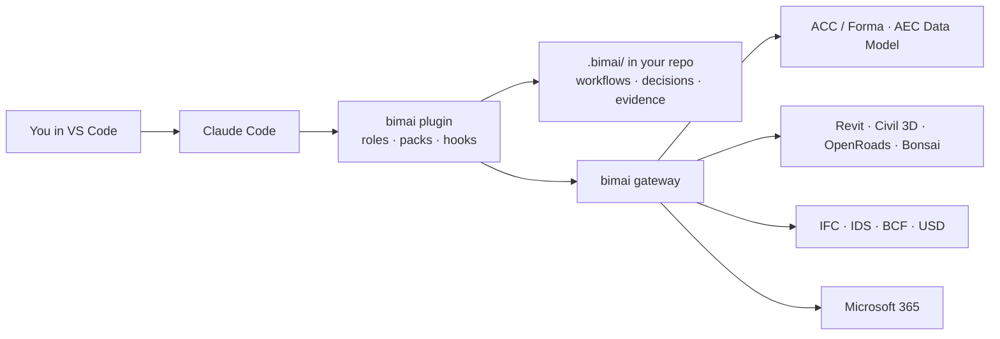

<p align="center">
  
</p>

<p align="center">
  <strong>An open-source BIM team that lives in your editor.</strong><br>
  Coordinate models, track requirements and risks, triage issues, write the minutes and plan your week,<br>
  with AI agents that follow your BIM process and show their evidence.
</p>

<p align="center">
  <a href="https://docs.bimai.nl"><strong>Documentation</strong></a> ·
  <a href="https://docs.bimai.nl/docs/why">For managers and directors</a> ·
  <a href="https://docs.bimai.nl/docs/example-project">Example project</a>
</p>

<p align="center">
  
  
  
  
</p>

---

> **⚠️ Pre-alpha.** bimai is being designed in the open. The architecture is written; the code is starting now.
> Commands below show the target experience for v0.1. Working so far: the [meeting-intake pack](packs/meeting-intake/), the [project-site generator](packs/project-site/) and the [documentation site](docs/). Star or watch the repo to follow along, and see [Contributing](#contributing) to help shape it.

## What is bimai?

AI can now read your Revit model and your ACC issues. What's missing is someone who knows **what a BIM professional actually does with them**: run the coordination round, check a delivery, chase the open issues, write it up, and remember what was decided.

bimai is that someone. It turns an AI coding harness (Claude Code first) into a **BIM team**:

```
You: "Prepare Thursday's coordination meeting."

  🧭 Coordinator      workflow: weekly-coordination → 6 steps, 2 parallel lanes
  📋 Issue Manager    47 open ACC issues · 9 overdue · 3 clusters found   ⎤ in
  🔍 Model Checker    delivery check on 3 models: 2 findings            ⎦ parallel
  ✋ You              review the findings → approve
  ✍️  Scribe           agenda written · 4 open decisions · evidence cited
```

Every agent works from files in your project repo, follows a workflow you define, cites the tool calls behind every claim, and **asks before it changes anything**.

## Why bimai?

| Today | With bimai |
|---|---|
| Plenty of Revit and ACC MCP servers, but each is a single tool with no BIM workflow | A team with BIM roles that knows what a clash round or a delivery check involves |
| Coding agents built for developers (frontend, backend, tester) | Roles BIM people recognise: coordinator, information manager, model checker, scribe |
| Vendor assistants that stay inside one product | One place that works across ACC, Revit, open formats and Microsoft 365 |
| AI answers you can't trace | Every output cites its evidence; every decision is logged in git |
| Chat that forgets | A project memory the whole team shares by cloning the repo |

## What you get

- **🧑‍🤝‍🧑 A team that fits your role:** a short interview at `bimai init` picks a small team from a catalogue (Coordinator, Requirements & Risk Manager, Planning Analyst, Information Manager, Model Checker, Issue Manager, Scribe, and more). A design coordinator gets a different team than a BIM modeller, and no one gets members they don't need.
- **📄 Your BEP becomes the configuration:** drop the BIM execution plan (Word or PDF) at onboarding. bimai extracts naming rules, tools and versions, responsibilities, coordination rhythm and milestones, each with its page reference, and sets up the project from what was actually agreed after you review it.
- **🌐 A site for every project:** a private website, generated from the project files, that explains the people, their AI teams, the BEP agreements, decisions, meetings and this week's work. Made for new colleagues, managers, directors and clients who never open VS Code. [See the example](https://docs.bimai.nl/docs/example-project).
- **👀 Open by default, so no context is lost:** each session leaves a short journal entry in the project, and project tasks are shared, so anyone can ask "what did the team do this week?" and a colleague covering for you knows where you left off. Your desk (plans, preferences, other clients' projects) stays private.
- **🤝 Work together, each with your own team:** a modeller, a coordinator and a design manager share one project: the same rules, context and decisions, but each with their own team. Every responsibility has one owner, and agents hand work to each other instead of getting in each other's way. Add more modellers or coordinators per discipline or zone, and hand over or cover a job when someone leaves or is ill; the agents' knowledge stays with the job.
- **🙈 No git or programming needed:** bimai saves, shares, updates and restores your work automatically, in plain language. Git runs underneath for history and safety; you never see it.
- **🎙️ Meeting transcripts to tasks:** drop the Teams or Zoom transcript of a coordination session. bimai writes the minutes, logs the decisions, gives each person their tasks and hands role-level work to the right position. Whenever it isn't sure (which Jan? decided or just discussed? project matter or personal?), it asks the person who uploaded it before anything is applied.
- **📐 Design coordination from your exports:** drop in a Relatics JSON export and a Primavera or MS Project XML planning, and get requirements status, risk reviews, schedule health and a weekly design progress report, with trends from every snapshot.
- **🗺️ Workflows, not improvisation:** chain small steps (scripts, tool calls, agents, other workflows, human approvals) in YAML, sequentially or in parallel. The engine decides the order; agents only do the thinking, so simple steps cost no tokens.
- **📅 A personal planner:** all your tasks and deadlines across projects, with a morning plan, a Friday review and deadline warnings.
- **🔌 Standard connectors:** ACC/Forma, the Autodesk AEC Data Model, Microsoft Graph, desktop apps like Revit, Civil 3D, Bentley OpenRoads and Blender/Bonsai, and open formats like IFC, all behind one gateway with the same safety rules.
- **⏰ Daily automations:** any workflow on a schedule (Windows Task Scheduler, cron or GitHub Actions). Unattended runs *propose* changes; you approve them later.
- **🧾 Evidence and memory in git:** decisions, history and a full audit trail, versioned alongside your project.
- **📊 See your setup:** `bimai graph` draws your team, workflows, connectors and projects as diagrams that render in GitHub and VS Code.
- **🪟 Windows, macOS and Linux:** cross-platform core; Windows-only BIM apps are clearly marked.
- **💶 Low token cost by default:** most roles run on smaller models; scripts do the counting and checking.

## How it works

bimai doesn't build its own agent runtime. It **configures** one, the way a Linux distribution configures a kernel.



Everything is one of five building blocks:

| Block | What it is |
|---|---|
| **Team** | Agent roles as markdown charters |
| **Workflow** | YAML that chains steps (scripts, tools, agents, other workflows, human gates) sequentially or in parallel |
| **Pack** | A reusable BIM procedure: a skill plus its scripts, templates and tests |
| **Connector** | A standard bridge to one tool: an API, a desktop app, a file format, or an existing MCP server |
| **Automation** | A workflow on a schedule |

A workflow reads like a checklist. Steps without `needs` run in parallel:

```yaml
id: weekly-coordination
steps:
  fetch-issues:  { tool: issues.list, with: { status: open } }
  fetch-models:  { tool: model.list_published }
  cluster:       { needs: [fetch-issues], script: acc-issue-triage/cluster.py }
  check-models:  { needs: [fetch-models], foreach: "${{ steps.fetch-models.output }}", workflow: delivery-check }
  review:        { needs: [cluster, check-models], gate: approval }
  agenda:        { needs: [review], agent: scribe, pack: coordination-meeting }
```

The full design is in **[ARCHITECTURE.md](ARCHITECTURE.md)**.

## Install

One line, no Python, git or administrator rights needed:

```powershell
# Windows
powershell -ExecutionPolicy ByPass -c "irm https://docs.bimai.nl/install.ps1 | iex"
```

```bash
# macOS and Linux
curl -LsSf https://docs.bimai.nl/install.sh | sh
```

Then run `bimai init` in your project folder. Update any time with `bimai update`.
More: [Install bimai](https://docs.bimai.nl/docs/start/install).

## Quick start (target for v0.1)

```bash
# 1. once per computer (planned): checks git and Claude Code, signs you in, creates your desk
bimai setup

# try everything first with sample data, no accounts needed
bimai new --demo

# 2a. start a new project (usually the BIM coordinator or information manager)
bimai new a2-knooppunt      # creates the shared project, runs the interview, gives a join link

# 2b. or join a project a colleague already started
bimai join https://github.com/your-org/a2-knooppunt
```

Everything lands in one folder on your computer:

```
~/bimai/
├── desk/                  private to you: your projects, plans, preferences
└── projects/
    └── a2-knooppunt/      shared with the project team: rules, decisions, everyone's tasks and journal
```


```
? What's your role on this project?        design coordinator
? Drop your BEP (Word or PDF):             BEP-A2-knooppunt-v3.pdf
  ✓ 38 agreements found · 2 open questions · Revit 2025, OpenRoads 2023, ACC
? What do you want help with?              requirements, risks, planning, progress reporting
? Which data do you have?                  Relatics export, Primavera planning

  Proposed team (4 of max 5):
  🧭 Coordinator                    always
  📐 Requirements & Risk Manager    goals: requirements, risks · data: Relatics
  📅 Planning Analyst               goal: planning · data: Primavera XML
  ✍️  Scribe                         goal: progress reporting
? Confirm team?                            yes
```

```bash
# add your exports (or drop them in .bimai/data/inbox/)
bimai data import exports/relatics.json
bimai data import planning/DO-planning.xml
```

Then `bimai open a2-knooppunt` opens the project in VS Code with Claude Code ready. Try:

```
/bimai:meeting          process a meeting transcript into minutes and tasks
/bimai:report           weekly design progress report
/bimai:triage           triage open ACC issues
/bimai:meeting-prep     agenda from issues + open decisions
/bimai:delivery-check   check a model against your delivery checklist
/bimai:plan             plan my day across all projects
```

## Principles

1. **Configure the harness, don't rebuild it.** Improvements to Claude Code make bimai better for free.
2. **Files are the source of truth.** Team, workflows, decisions and history live in git.
3. **Agents reason, scripts decide.** Anything checkable is computed by deterministic code.
4. **Read by default.** Every write goes through a human approval gate.
5. **Every claim has evidence.**
6. **One contract for every extension.** A community connector behaves exactly like a built-in one.
7. **Open formats first.** IFC, IDS, BCF and OpenUSD are the long-term backbone.
8. **Proven by evals.** Nothing ships without passing realistic BIM scenarios.

## Extend bimai

bimai is built to be built on. The **Builder** role walks you through a fixed recipe for any tool:

```
/bimai:new-connector    scaffold a connector (api · desktop-bridge · file · upstream MCP)
/bimai:new-pack         scaffold a skill + scripts + tests
/bimai:certify          run conformance tests and evals → experimental / beta / stable
/bimai:register         add it to your project's gateway, read-only first
```

Want a custom Revit API server, a Blender/Bonsai bridge or a Solibri connector? Follow the same contract and it gets the approval gate, the evidence trail, the test harness and the scheduler for free. See [§9 of the architecture](ARCHITECTURE.md#9-building-on-top-how-the-system-extends-itself).

Packs depend on **capabilities** (`issues.read`, `model.query`), not on vendors. A pack written for ACC today runs on BCF tomorrow, and one written for Revit runs on Bonsai and IfcOpenShell.

## Roadmap

- [ ] **v0.1: the core.** CLI and workflow engine, the plugin with its roles and hooks, onboarding with role presets, Relatics and planning XML imports, the connector kit, the ACC issues connector, the gateway, workflows for design coordination and BIM coordination, the Planner, daily automations, and a 10-scenario eval suite
- [ ] **v0.2: extend.** Desktop-bridge and file connector templates, the Builder role, the registry, and a contributor guide ("add a BIM tool in an afternoon")
- [ ] **v0.3: open BIM.** IFC, IDS and BCF connectors, and IFC/USD enrichment with assertion provenance
- [ ] **Later:** adapters for other harnesses (GitHub Copilot, AGENTS.md), and organization profiles with company standards, templates and workflows in one install

## Contributing

bimai is for the BIM community, and it's being shaped right now. The most useful contributions at this stage:

- **BIM professionals:** your real workflows. What does your coordination round, delivery check or handover look like? Open a discussion with the steps.
- **Developers:** the CLI core, the connector kit and the first connectors (see the build order in [ARCHITECTURE.md](ARCHITECTURE.md#14-mvp-and-build-order)).
- **Writers:** documentation is part of done. Every change ships with its page in [`docs/`](docs/); CI fails when a command or pack has no page.
- **Everyone:** eval scenarios. A realistic task with an expected result is the best way to make the agents trustworthy.

Please open an issue before starting larger work, so we can agree on the approach.

## Acknowledgements

- [Squad](https://github.com/bradygaster/squad) by Brady Gaster, for the idea of an AI team that lives in your repo as files
- [Claude Code](https://www.anthropic.com/claude-code), the harness bimai runs on first
- [IfcOpenShell](https://ifcopenshell.org), [Bonsai](https://bonsaibim.org) and [buildingSMART](https://www.buildingsmart.org), for the open BIM foundations

bimai is an independent open-source project. It is not affiliated with or endorsed by Autodesk, Microsoft, Anthropic or buildingSMART. Product names are trademarks of their respective owners.

## License

[MIT](LICENSE). Free to use, change and share, including commercially.
