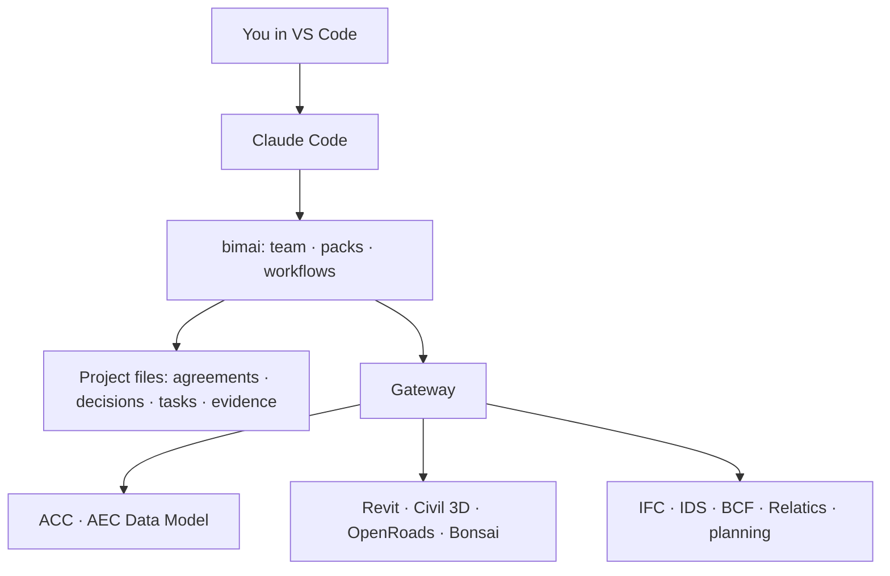

| Block | What it is | Example |
|---|---|---|
| **Team** | A few agent roles, picked for a person during onboarding | Coordinator, Issue Manager, Scribe |
| **Workflow** | Steps chained in order or in parallel | Weekly coordination: fetch issues and models, check, review, write agenda |
| **Pack** | One reusable BIM procedure: instructions, scripts, templates and tests | `meeting-intake`, `requirements-status` |
| **Connector** | A standard bridge to one tool or data source | ACC, Revit, Civil 3D, OpenRoads, IFC, Relatics export |
| **Automation** | A workflow on a schedule | Daily issue digest at 07:45 |

Two pieces tie them together: the **gateway**, the single connection point through which agents
reach every tool under the same safety rules, and the **workflow engine**, which runs workflows
interactively or on a schedule.

bimai doesn't have its own AI engine. It configures Claude Code, the way a Linux distribution configures
a kernel: improvements to the engine make bimai better for free.

