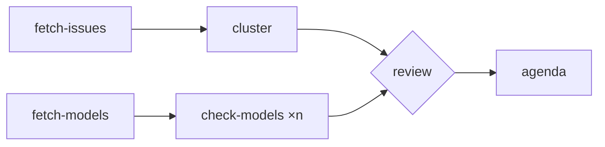

A workflow is a short YAML file. Each step does one thing: run a script, call a tool, give work to an
agent, start another workflow, or wait for a person. Steps without `needs` start in parallel.

```yaml
id: weekly-coordination
steps:
  fetch-issues:  { tool: issues.list, with: { status: open } }
  fetch-models:  { tool: model.list_published }
  cluster:       { needs: [fetch-issues], script: acc-issue-triage/cluster.py }
  check-models:  { needs: [fetch-models], foreach: "${{ steps.fetch-models.output }}", workflow: delivery-check }
  review:        { needs: [cluster, check-models], gate: approval }
  agenda:        { needs: [review], agent: scribe, pack: coordination-meeting }
```



- **The engine decides the order, not the AI.** Only `agent` steps use a model, so a workflow of
  scripts and tool calls costs nothing to run.
- **Interrupted runs resume** from the last completed step.
- **Checked before running:** `bimai workflow plan` shows the order, the parallel lanes and the
  expected cost.
