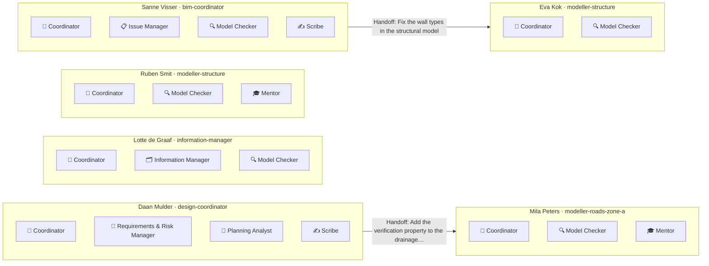

Every person has their own small AI team, chosen for their role and the data they work with. The teams share the project's agreements and decisions, and hand work to each other instead of doing it twice.

### Daan Mulder · `design-coordinator`

| Member | What it does | Why | Model |
|---|---|---|---|
| 🧭 Coordinator | Runs the team and the workflows, talks to the person | Always | sonnet |
| 📐 Requirements & Risk Manager | Requirements, verification and risks | Goals: requirements, risks · Data: Relatics export | sonnet |
| 📅 Planning Analyst | Milestones, critical path, slipping deliverables | Goal: planning · Data: Primavera XML | haiku |
| ✍️ Scribe | Minutes, reports, decision log | Goal: design progress reporting | sonnet |

### Eva Kok · `modeller-structure`

| Member | What it does | Why | Model |
|---|---|---|---|
| 🧭 Coordinator | Runs the team and the workflows, talks to the person | Always | sonnet |
| 🔍 Model Checker | Checks models against the agreements | Goal: model checks · Data: Revit | haiku |

### Lotte de Graaf · `information-manager`

| Member | What it does | Why | Model |
|---|---|---|---|
| 🧭 Coordinator | Runs the team and the workflows, talks to the person | Always | sonnet |
| 🗂️ Information Manager | BEP compliance, naming, deliveries | Goals: BEP compliance, deliveries · Data: ACC documents | sonnet |
| 🔍 Model Checker | Checks models against the agreements | Goal: delivery checks · Data: AEC Data Model | haiku |

### Mila Peters · `modeller-roads-zone-a`

| Member | What it does | Why | Model |
|---|---|---|---|
| 🧭 Coordinator | Runs the team and the workflows, talks to the person | Always | sonnet |
| 🔍 Model Checker | Checks models against the agreements | Goal: model checks · Data: Civil 3D | haiku |
| 🎓 Mentor | Explains the tools, on request | New to VS Code | haiku |

### Ruben Smit · `modeller-structure`

| Member | What it does | Why | Model |
|---|---|---|---|
| 🧭 Coordinator | Runs the team and the workflows, talks to the person | Always | sonnet |
| 🔍 Model Checker | Checks models against the agreements | Goal: model checks · Data: Revit, Civil 3D | haiku |
| 🎓 Mentor | Explains the tools, on request | New to VS Code | haiku |

### Sanne Visser · `bim-coordinator`

| Member | What it does | Why | Model |
|---|---|---|---|
| 🧭 Coordinator | Runs the team and the workflows, talks to the person | Always | sonnet |
| 📋 Issue Manager | Triages and follows up issues | Goal: issues · Data: ACC | haiku |
| 🔍 Model Checker | Checks models against the agreements | Goal: model checks · Data: Revit, Civil 3D | haiku |
| ✍️ Scribe | Minutes, reports, decision log | Goal: meetings and minutes | sonnet |

## How the teams hand work to each other

| Date | Handoff | From | To | Status |
|---|---|---|---|---|
| 2026-09-25 | Add the verification property to the drainage elements in zone A | Daan Mulder (Requirements & Risk Manager) | `modeller-roads-zone-a` | open |
| 2026-09-24 | Fix the wall types in the structural model | Sanne Visser (Issue Manager) | `modeller-structure` | done |
