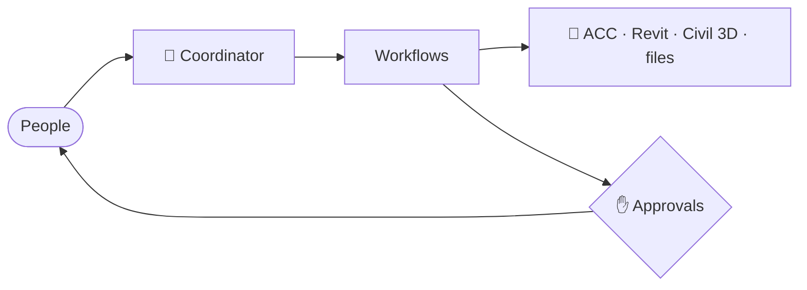
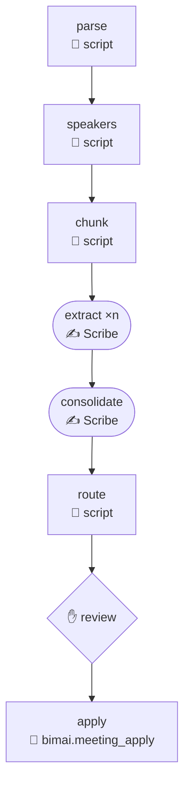
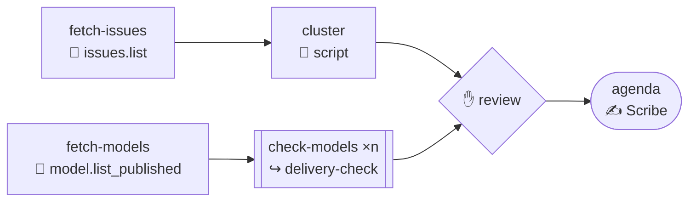

How a request flows through a team:

## Approvals

- **Changes to models and ACC:** Agents propose changes; a person approves each one first.
- **Changes to shared rules are approved by:** Lotte de Graaf

## Coordination rhythm

Clash coordination session every other Tuesday; clash tolerance 20 mm

Source: BIM execution plan v3 · p. 30 · §9.2 Coordination rhythm

## Workflows

### meeting-intake

Transcript → minutes, decisions, tasks and handoffs; the uploader answers every uncertainty

### weekly-coordination

Collect issues and model status, check models, review, write the agenda

## Automations

| Automations | Schedule | Owner | Mode |
|---|---|---|---|
| `daily-triage` | Weekdays 07:45 | `bim-coordinator` | read-only |
| `weekly-design-report` | Fridays 08:00 | `design-coordinator` | read-only |
