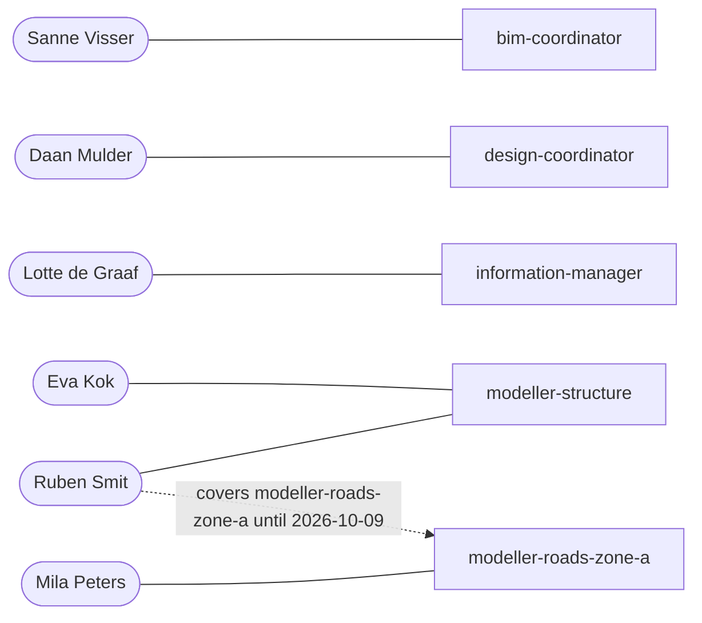

A **position** is a job on the project. People hold positions; what the AI agents learn in a job stays with the position, so whoever takes over starts with everything.

## Positions

| Position | Role | Scope | Held by | Cover |
|---|---|---|---|---|
| `bim-coordinator` | bim-coordinator | — | Sanne Visser | — |
| `design-coordinator` | design-coordinator | — | Daan Mulder | — |
| `information-manager` | information-manager | — | Lotte de Graaf | — |
| `modeller-structure` | bim-modeller | discipline: structure | Eva Kok (lead), Ruben Smit | — |
| `modeller-roads-zone-a` | bim-modeller | discipline: roads, zone: A | Mila Peters | Ruben Smit → 2026-10-09 |

## Who owns what

| Responsibility | Position |
|---|---|
| issue triage | `bim-coordinator` |
| clash coordination | `bim-coordinator` |
| coordination meetings | `bim-coordinator` |
| requirements | `design-coordinator` |
| risks | `design-coordinator` |
| design progress reporting | `design-coordinator` |
| bep compliance | `information-manager` |
| delivery checks | `information-manager` |
| naming | `information-manager` |
| model corrections | `modeller-structure` |
| model corrections | `modeller-roads-zone-a` |

## People

| Name | Title | Organization |
|---|---|---|
| Sanne Visser | BIM coordinator | Contractor |
| Daan Mulder | Design coordinator | Contractor |
| Lotte de Graaf | Information manager | Contractor |
| Eva Kok | BIM modeller | Contractor |
| Ruben Smit | BIM modeller | Contractor |
| Mila Peters | BIM modeller | Contractor |

## External parties

| Name | Title | Organization |
|---|---|---|
| Tom Hendriks | MEP engineer | Installatiebedrijf Noord (demo) |
| Ingrid Vos | BIM manager | Demo Client |
