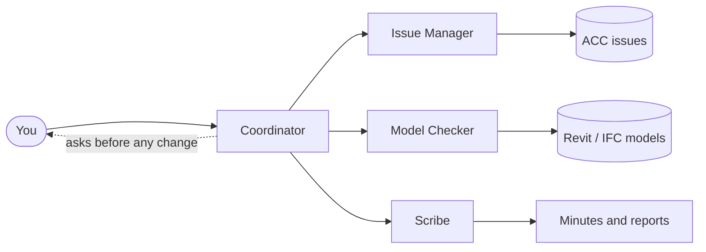

## A team, not a chatbot

Think of bimai as a small support team that each BIM professional gets on their project. Every team
member has one job: the **Issue Manager** triages issues, the **Model Checker** checks models against
the agreements, the **Scribe** writes minutes and reports, the **Planning Analyst** watches milestones.
A **Coordinator** runs the team and talks to you.

## The project's agreements are the rules

When a project starts, bimai reads its **BIM execution plan**. It picks out the agreements (who is
responsible for what, which software and versions, how files are named, when coordination sessions
are, when deliveries are due) and shows them to you with the page they came from. After you confirm
them, every agent on the project follows them.

## Every person has their own team

A modeller, a BIM coordinator and a design manager on the same project each get a team that fits their
work. They share the same agreements, decisions and project knowledge, so the teams stay aligned. When
one team finds work that belongs to someone else, it hands it over instead of doing it.

## Work stays with the project

Decisions, meeting minutes, tasks and what the agents learned are stored with the project, not in
someone's head or laptop. When a colleague is ill or leaves, the person who takes over starts with
everything that was done in that job.

## People stay in control

Agents **read** freely but **change** nothing without approval. Before anything is written to a model,
to ACC or to the project's shared rules, a person sees exactly what will happen and says yes or no.
